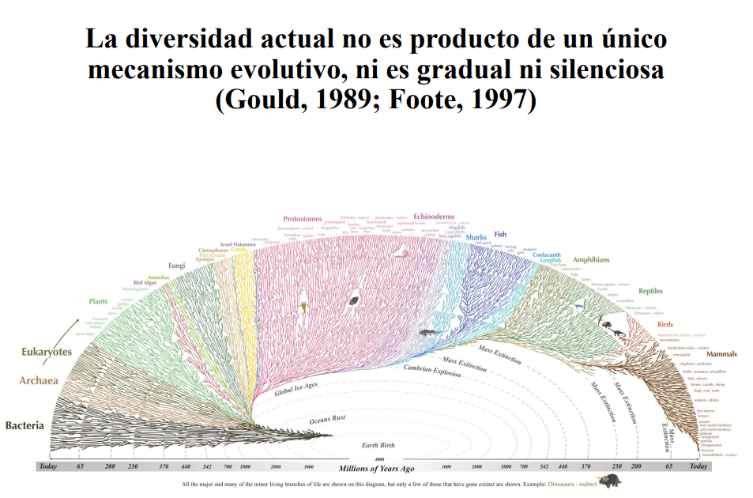

# Presentación: Introducción al proceso de diversificación

[{fig-align="center" width="500"}](../docs/u1_PatDiv/2IntroDiversificaciónPCB_2027_2.pdf)

Haz clic en la imagen para ver el PDF de la presentación

# Introducción a los métodos de diversificación

En este módulo exploraremos dos enfoques para el análisis de tasas de diversificación:

-   **TreePar**: Implementado en R, este paquete permite detectar cambios en las tasas de especiación y extinción en árboles filogenéticos a partir de datos temporales. Nos enfocaremos en la función `bd.shifts.optim`, que optimiza modelos de nacimiento y muerte con cambios de tasa.

-   **RevBayes**: Utilizaremos el enfoque bayesiano para modelar la variación en tasas de diversificación a lo largo del tiempo, siguiendo el tutorial oficial [Simple Diversification Rate Model](https://revbayes.github.io/tutorials/divrate/simple.html).

# Instalación de Paquetes en R

Para realizar los análisis de diversificación, es necesario instalar y cargar varios paquetes en R. Si no los tienes instalados, puedes ejecutar el siguiente código:

``` r
# Instalar tidyverse si no está instalado
if (!requireNamespace("tidyverse", quietly = TRUE)) {
  install.packages("tidyverse", dependencies = TRUE)
}

# Instalar ape si no está instalado
if (!requireNamespace("ape", quietly = TRUE)) {
  install.packages("ape", dependencies = TRUE)
}

# Instalar BiocManager si no está instalado
if (!requireNamespace("BiocManager", quietly = TRUE)) {
  install.packages("BiocManager", dependencies = TRUE)
}

# Instalar ggtree y treeio si no están instalados
if (!requireNamespace("ggtree", quietly = TRUE) || !requireNamespace("treeio", quietly = TRUE)) {
  BiocManager::install(c("ggtree", "treeio"))
}

# Instalar subplex si no está instalado
if (!requireNamespace("subplex", quietly = TRUE)) {
  install.packages("subplex", dependencies = TRUE)
}

# Instalar TreeSim si no está instalado
if (!requireNamespace("TreeSim", quietly = TRUE)) {
  install.packages("TreeSim", dependencies = TRUE)
}

# Instalar deSolve si no está instalado
if (!requireNamespace("deSolve", quietly = TRUE)) {
  install.packages("deSolve", dependencies = TRUE)
}

# Instalar phytools si no está instalado
if (!requireNamespace("phytools", quietly = TRUE)) {
  install.packages("phytools")
}

# Instalar DDD si no está instalado
if (!requireNamespace("DDD", quietly = TRUE)) {
  install.packages("DDD")
}

# Instalar RevGadgets si no está instalado
if (!requireNamespace("RevGadgets", quietly = TRUE)) {
  install.packages("RevGadgets")
}
```

# Instalación de TreePar en R

El paquete **TreePar** no está disponible directamente desde CRAN, pero podemos instalarlo mediante dos métodos. Si no te funciona el primer método intenta el segundo:

## 1.- Mediante la liberia `remotes`

```{r}
# Instalar remotes si no está instalado
if (!requireNamespace("remotes", quietly = TRUE)) {
  install.packages("remotes")
}

# Instalar TreePar
remotes::install_github("tanja819/TreePar")
```

## 2.- Descargar el paquete TreePar

### Puedes descargar el paquete desde el siguiente enlace:

📥 [Descargar TreePar 3.3](http://cran.nexr.com/src/contrib/TreePar_3.3.tar.gz)

Guarda el archivo en una carpeta de tu elección (por ejemplo, en `~/Descargas/` o `C:/Users/TuUsuario/Downloads/`).

------------------------------------------------------------------------

### Instalar TreePar desde el archivo descargado

Una vez que hayas descargado el archivo `TreePar_3.3.tar.gz`, abre R y ejecuta el siguiente código para instalarlo:

``` r
# Definir la ruta donde se descargó el archivo
ruta_archivo <- "~/Descargas/TreePar_3.3.tar.gz"  # Cambia esta ruta según tu sistema operativo

# Instalar el paquete desde el archivo .tar.gz
install.packages(ruta_archivo, repos = NULL, type = "source")
```

# Preparación del Árbol Filogenético para Análisis

Para realizar los análisis de tasas de diversificación, primero debemos preparar el árbol filogenético. En esta sección, cargaremos el árbol en R, filtraremos los taxones de interés y generaremos un subárbol optimizado.

------------------------------------------------------------------------

## Descarga del Árbol Filogenético

📥 Puedes descargar el archivo **NEXUS** con el árbol de estudio en el siguiente enlace:

<a href="../docs/u1_PatDiv/allSamples.tre" download>📥 Descargar Árbol Filogenético</a>

Guarda el archivo en la carpeta correspondiente y verifica su ubicación antes de continuar.

------------------------------------------------------------------------

## Cargar y Visualizar el Árbol en R

Ejecuta el siguiente código en R para cargar el archivo y visualizar el árbol completo:

```{r}
# Cargar los paquetes necesarios
library(ape)
library(ggtree)
library(treeio)
library(tidyverse)

# Definir la ruta del archivo NEXUS
archivo_nexus <- "../docs/u1_PatDiv/allSamples.tre"  # Asegúrate de cambiar esta ruta si es necesario

# Cargar el árbol
arbol <- read.nexus(archivo_nexus)

# Calcular el Límite Máximo del Eje X
max_edge_length <- max(arbol$edge.length, na.rm = TRUE)

# Graficar el árbol
ggtree(arbol) +
  geom_tiplab(size = 3) +
  geom_text2(aes(subset = !isTip, label = node), hjust = -0.3) +  # Etiquetar nodos internos
  xlim(-0.5, max_edge_length * 1.4) +
  theme_tree2()

```

## Extraer los nombres de las terminales de un nodo específico:

Utilizar la función `getDescendants` para obtener los nombres de todas la terminales del nodo interno **61**:

```{r}
library(phytools)

nodo_interes <- 61  # Reemplaza este valor por el nodo de tu interés

# Obtener los índices de los nodos descendientes
nodos_internos <- getDescendants(arbol, nodo_interes)

# Filtrar solo los índices que corresponden a las terminales (tips)
indices_tips <- nodos_internos[nodos_internos <= length(arbol$tip.label)]

# Obtener los nombres de las terminales
nombres_tips <- arbol$tip.label[indices_tips]

# Mostrar los nombres de las terminales
print(nombres_tips)

```

## Uso de `getMRCA` y `extract.clade` para extraer Subárboles Filogenéticos

```{r}
# Obtener el nodo más reciente en común del ingroup
mrca_ingroup <- getMRCA(arbol, nombres_tips)

# Extraer el subárbol del ingroup
subarbol <- extract.clade(arbol, mrca_ingroup)

# Calcular la longitud máxima de las ramas del subárbol
max_edge_length <- max(subarbol$edge.length, na.rm = TRUE)

# Graficar el subárbol
ggtree(subarbol) +
  geom_tiplab(size = 3) +
  xlim(-0.5, max_edge_length * 2) +
  theme_tree2()
```

## Remover especies duplicadas

```{r}
# Separar los nombres de las especies (asumiendo el formato "ID_Especie")
species_info <- data.frame(
  tip_label = nombres_tips,
  species = str_extract(nombres_tips, "[A-Za-z]+_[A-Za-z]+(?:_[A-Za-z]+)?$")
)

# Eliminar las ssp _h y _p
# Seleccionar solo una muestra por especie
unique_species <- species_info %>%
  filter(!str_detect(species, "_[hp]$")) %>%
  group_by(species) %>% 
  slice(1) %>%  # Selecciona solo la primera aparición de cada especie
  ungroup()

# Extraer los nombres de los tips que queremos conservar
selected_tips <- unique_species$tip_label

# Remover duplicados
subarbol_final <- drop.tip(subarbol, setdiff(subarbol$tip.label, selected_tips))

ggtree(subarbol_final) + 
  geom_tiplab(size = 3) + 
  xlim(-0.5, max(subarbol_final$edge.length) * 2)  # Expande el espacio a la izquierda

```

## Guardar el árbol resultante en formato NEXUS

```{r}
write.nexus(subarbol_final, file="../docs/u1_PatDiv/subarbol_ingroup.nex")
```

# Estimar tasas de especiación y extinción a lo largo del tiempo.

## Carga del Árbol Filogenético

```{r}
# Carga de paquetes
library(subplex)
library(TreeSim)
library(deSolve)
library(ape)       
library(TreePar)

# Cargar el árbol desde un archivo Nexus
tree <- read.nexus("../docs/u1_PatDiv/subarbol_ingroup.nex")

# Visualizar el árbol
ggtree(tree) + theme_tree()

```

## Obtención de los Tiempos de Especiación

Extraeremos y ordenaremos los tiempos de especiación (tiempos de ramificación) del árbol:

```{r}
# Obtener y ordenar los tiempos de especiación
# La función getx() extrae los tiempos de ramificación del árbol.
times <- sort(getx(tree), decreasing = TRUE) # sort () rdena los tiempos en orden descendente.
times <- unname(times) # elimina los nombres de los elementos del vector para simplificar su manipulación.
print(times)
```

## Configuración de Parámetros para el Análisis

Definiremos los parámetros necesarios para el análisis de cambios en las tasas de diversificación:

```{r}
rho <- 22/26  # Proporción de especies muestreadas (22 de 26 especies)
grid <- 0.2   # Tamaño de la grilla de búsqueda de cambios de tasa (en millones de años)
start <- min(times)   # Tiempo inicial para la búsqueda de cambios de tasa
end <- max(times)     # Tiempo final para la búsqueda de cambios de tasa
```

## Ejecución del Análisis con `bd.shifts.optim`

Utilizaremos la función `bd.shifts.optim` para estimar las tasas de especiación y extinción, así como los puntos en el tiempo donde ocurren cambios significativos en estas tasas:

```{r}
# Ejecutar el análisis de cambios en las tasas de diversificación
result_shifts <- bd.shifts.optim(times, rho, grid, start, end, yule=TRUE)

# Mostrar los resultados
result_shifts[[2]][[1]]
```

A continuación se presentan los valores obtenidos en la estimación de la tasa de diversificación. Dado que el modelo **Yule** asume que no hay extinción, la tasa de extinción no está definida en este análisis.

-   Valor de la función de verosimilitud negativa: **70.02138**

-   Tasa de especiación $\lambda$: **0.08913**

En este contexto:

Estos valores indican que la tasa de especiación estimada ($\lambda$) es aproximadamente **0.08913**.

El valor de la función de verosimilitud negativa (**70.02138**) proporciona una medida del ajuste del modelo a los datos, donde valores más bajos generalmente indican un mejor ajuste.

# Estimación simple de la tasa de diversificación con RevBayes

## Crear un script de `RevBayes` en Visual Studio Code: `divrate.Rev`

## Cargar el archivo NEXUS

``` r
# Cargar la filogenia desde el archivo NEXUS
T <- readTrees("../docs/u1_PatDiv/subarbol_ingroup.nex")[1]

# Obtener la lista de taxones en la filogenia
taxa <- T.taxa()
```

## Inicializar los vectores de moves y monitors

``` r
# Inicializar un vector vacío para los movimientos (moves)
moves = VectorMoves()

# Inicializar un vector vacío para los monitores (monitors)
monitors = VectorMonitors()
```

{fig-align="center" width="450"}

Representación del modelo gráfico para el proceso Yule (Pure-Birth) en RevBayes, donde la tasa de especiación ($\lambda$) es tratada como una variable aleatoria extraída de una distribución uniforme.

## Especificar la tasa de especiación ($\lambda$)

``` r
# Especificar la tasa de especiación λ con una distribución uniforme
birth_rate ~ dnUniform(0, 100.0)
```

## Asignar un movimiento MCMC a la tasa de especiación

``` r
# Agregar un movimiento MCMC para la tasa de especiación
moves.append( mvScale(birth_rate, lambda=1.0, tune=true, weight=3.0) )
```

## Especificar la proporción de especies muestreadas **(**$\rho$)

``` r
# Obtener el número de taxones en la filogenia
num_taxa <- T.ntips()

# Estimar la proporción de especies muestreadas
rho <- num_taxa / 26
```

## Obtener la edad de la raíz

``` r
# Obtener la edad de la raíz del árbol
root_time <- T.rootAge()
```

## Definir el modelo de tiempo de especiación

El modelo Yule (pure-birth) en RevBayes se define con el **proceso de nacimiento y muerte (`dnBDP`)**, pero con la tasa de extinción (`mu`) fijada en **0**.

``` r
# Definir el modelo de diversificación usando un proceso de nacimiento-muerte (BDP)
timetree ~ dnBDP(lambda=birth_rate, mu=0.0, rho=rho, rootAge=root_time, samplingStrategy="uniform", condition="survival", taxa=taxa)
```

**Explicación**

-   `lambda = birth_rate` → Tasa de especiación es una variable aleatoria con `dnUniform(0, 100.0)`.

-   `mu = 0.0` → Asumimos que no hay extinción (modelo Yule).

-   `rho = rho` → Se ajusta según el número de especies muestreadas.

-   `rootAge = root_time` → Condicionamos el modelo en la edad de la raíz.

-   `samplingStrategy = "uniform"` → Asumimos muestreo uniforme.

-   `condition = "survival"` → Solo analizamos árboles que sobrevivieron hasta el presente.

## Fijar la filogenia observada

``` r
# Fijar la filogenia observada
timetree.clamp(T)
```

## Definir el modelo gráfico

``` r
# Crear el objeto de modelo
mymodel = model(birth_rate)
```

Esto crea un modelo gráfico dirigido acíclico (DAG) donde birth_rate es el nodo principal, y RevBayes automáticamente encuentra todos los otros nodos conectados.

## Especificar los Monitores

``` r
# Monitor para registrar los estados del modelo en un archivo de salida
monitors.append( mnModel(filename="output/diversification_Yule.log", printgen=10, separator=TAB) )

# Monitor para imprimir la tasa de especiación en la pantalla cada 1000 generaciones
monitors.append( mnScreen(printgen=1000, birth_rate) )
```

**Explicación**

-   **`mnModel`** guarda el registro de la ejecución en `"output/diversification_Yule.log"`, escribiendo cada **10** generaciones.

-   **`mnScreen`** imprime la tasa de especiación (`birth_rate`) en la consola cada **1000** generaciones.

## Configurar y ejecutar el MCMC

``` r
# Inicializar el MCMC con dos cadenas combinadas en un solo análisis
mymcmc = mcmc(mymodel, monitors, moves, nruns=2, combine="mixed")

# Ejecutar el MCMC por 50,000 generaciones, ajustando los movimientos cada 200 generaciones
mymcmc.run(generations=50000, tuningInterval=200)
```

**Explicación**

-   **`nruns=2`** → Corre dos cadenas independientes.

-   **`combine="mixed"`** → Combina las cadenas en un solo conjunto de muestras.

-   **`generations=50000`** → Ejecuta la simulación por 50,000 generaciones.

-   **`tuningInterval=200`** → Ajusta los movimientos cada 200 generaciones para mejorar la eficiencia del muestreo.

## Cargar los resultados en RevGadgets

Después de correr el MCMC en RevBayes, usar **RevGadgets** en **R** para analizar la distribución posterior:

```{r}
# Cargar librerías necesarias
library(RevGadgets)
library(ggplot2)

# Leer los datos del MCMC
mcmc_trace <- readTrace("../docs/u1_PatDiv/output/diversification_Yule.log")

# Visualizar la distribución posterior de birth_rate
plotTrace(mcmc_trace, vars="birth_rate")
```

## Calcular la media y el intervalo de HPD (Highest Posterior Density)

```{r}
# Calcular la media posterior y el HPD del 95%
summary_stats <- summarizeTrace(mcmc_trace, vars="birth_rate")
print(summary_stats)
```

## Comparar la distribución previa y posterior

```{r}
library(RevGadgets)
library(ggplot2)

# Leer los datos del MCMC combinando las dos cadenas
posterior_trace <- readTrace(c("../docs/u1_PatDiv/output/diversification_Yule_run_1.log", "../docs/u1_PatDiv/output/diversification_Yule_run_2.log"))

# Extraer el primer conjunto de muestras (lista de data frames)
yule_posterior <- posterior_trace[[1]]

# Simular 10,000 valores de la distribución previa
yule_prior <- data.frame(birth_rate = runif(10000, min=0, max=100))

# Agregar la columna de la distribución previa en el posterior
yule_posterior$birth_rate_prior <- sample(yule_prior$birth_rate, size = nrow(yule_posterior), replace = TRUE)

# Graficar la comparación
plotTrace(list(yule_posterior), vars = c("birth_rate", "birth_rate_prior"))[[1]] +
  theme(legend.position = c(0.80, 0.80),  # Ubicación de la leyenda
        legend.text = element_text(size =20),  # Tamaño del texto de la leyenda
        legend.title = element_text(size = 22)) +  # Tamaño del título de la leyenda
  xlim(0, 1)  # Ajusta el límite según los valores observados
```
