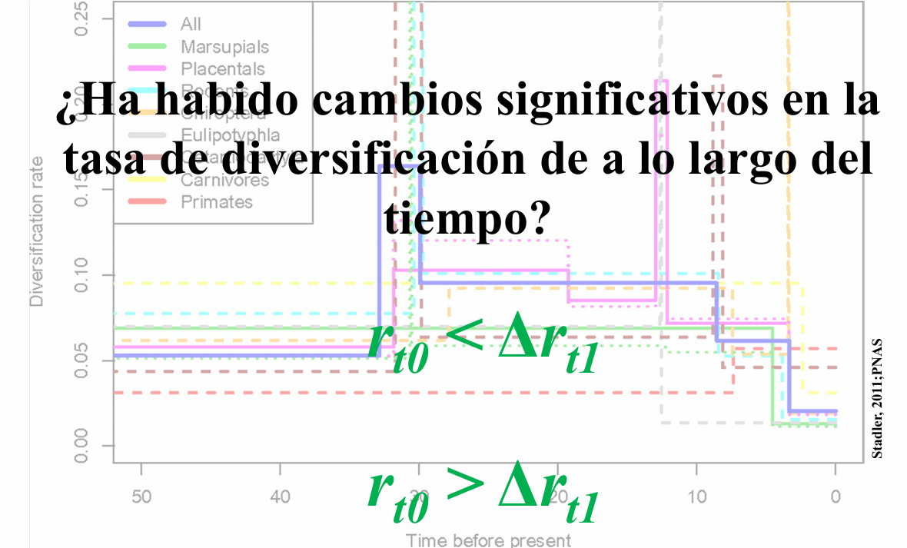

# Presentación: Modelos con cambios en las tasas de diversificación

[{fig-align="center" width="500"}](../docs/u1_PatDiv/DivRatesTt.pdf)

Haz clic en la imagen para ver el PDF de la presentación

# Modelos con cambios en las Tasas de diversificación en **R** con **TreePar**

## Introducción

En estudios filogenéticos, los modelos de **nacimiento-muerte** (*birth-death models*) permiten inferir cómo han cambiado las tasas de diversificación ($\lambda$) y extinción ($\mu$) a lo largo del tiempo. Sin embargo, estas tasas no son siempre constantes. Diversos eventos evolutivos, como la aparición de nuevas adaptaciones o cambios ambientales, pueden causar variaciones en la dinámica de diversificación de un linaje.

El paquete **TreePar** permite ajustar modelos de diversificación con cambios en la tasa mediante la función `bd.shifts.optim()`. Esta función estima la mejor combinación de tasas de diversificación y extinción en diferentes periodos de tiempo, según la estructura de una filogenia dada.

## Cargar librerías y el árbol filogenético

```{r}
# Cargar las librerías necesarias
library(ape)       
library(TreePar)
library(tidyverse)
library(ggtree)

# Cargar el árbol desde un archivo Nexus
tree <- read.nexus("../docs/u1_PatDiv/subarbol_ingroup.nex")

# Visualizar el árbol
ggtree(tree) + theme_tree()
```

## Obtención de los tiempos de diversificación

Extraeremos y ordenaremos los tiempos de diversificación (tiempos de ramificación) del árbol:

```{r}
# Obtener y ordenar los tiempos de especiación
# La función getx() extrae los tiempos de ramificación del árbol.
times <- sort(getx(tree), decreasing = TRUE) # sort() ordena los tiempos en orden descendente.
times <- unname(times) # elimina los nombres de los elementos del vector para simplificar su manipulación.
print(times)
```

## Configuración de Parámetros para el Análisis

Definiremos los parámetros necesarios para el análisis de cambios en las tasas de diversificación:

```{r}
rho <- 22/26  # Proporción de especies muestreadas (22 de 26 especies)
grid <- 0.2   # Tamaño de la grilla de búsqueda de cambios de tasa (en millones de años)
start <- min(times)   # Tiempo inicial para la búsqueda de cambios de tasa
end <- max(times)     # Tiempo final para la búsqueda de cambios de tasa
```

## Modelo de nacimiento-muerte sin cambios

```{r}
resbd <- bd.shifts.optim(times, rho, grid, start, end)
resbd[[2]] 
```

| Índice | Parámetro estimado | Descripción |
|------------------------|------------------------|------------------------|
| **1** | 70.02138 | **−log**L (*negative log-likelihood*) del modelo|
| **2** | $3.10 \times 10^{-7}$ | Turnover ($\epsilon = \mu/\lambda$) |
| **3** | 0.08910 | Diversificación neta ($r = \lambda - \mu$) |

## Modelo con un cambio

Aquí probamos un modelo en el que la tasa cambia en un tiempo $t_{1}$

| Parámetro | Significado |
|------------------------------------|------------------------------------|
| `time` | Tiempos de ramificación (*branching/speciation times*) del árbol. |
| `c(rho, 1)` | **rho** indica que se ha muestreado el 80 % de las especies actuales. El segundo valor, 1, corresponde al evento/cambio considerado en el pasado. |
| `grid` | Intervalo de discretización del tiempo |
| `start, end` | Rango de tiempo para el análisis |
| `ME=FALSE` | No se consideran eventos de extinción masiva |
| `survival=1` | La verosimilitud se condiciona a la supervivencia del proceso; específicamente, a la supervivencia de los dos linajes existentes en la raíz. |

```{r, results='hide'}
resoneshift <- bd.shifts.optim(times, c(rho, 1), grid, start, end, ME=FALSE, survival=1)
resoneshift[[2]][[2]]  # Verosimilitud del modelo con un cambio en la tasa
```

```{r, echo=FALSE}
# Ejecuta el análisis (puedes definir resoneshift en otro chunk)
resoneshift[[2]][[2]]  
```

**Interpretación**

| Índice | Parámetro estimado | Descripción |
|------------------------|------------------------|------------------------|
| **1** | 62.95893 | **−log**L (*negative log-likelihood*) del modelo. Valores menores indican mejor ajuste. |
| **2** | 0.99526 | Turnover antes del cambio **(**$\epsilon_0$) |
| **3** | 0.08528 | Turnover después del cambio **(**$\epsilon_1$) |
| **4** | 0.00010 | Diversificación antes del cambio **(**$r_0$) |
| **5** | 0.15949 | Diversificación después del cambio **(**$r_1$) |
| **6** | 6.12523 | tiempo del cambio |

Graficar el modelo con un cambio en la tasa

```{r}
bd.shifts.plot(list(resoneshift[[2]]), shifts = 1, timemax = max(times), ratemin = 0, ratemax = 1.1, plotturnover = TRUE)
```

## Modelo con dos cambios

```{r, results='hide'}
restwoshift <- bd.shifts.optim(times, c(0.8,1,1), grid, start, end, ME=FALSE, survival=1)
restwoshift[[2]][[3]]
```

```{r, echo=FALSE}
restwoshift[[2]][[3]]
```

**Interpretación**

| Índice | Parámetro estimado | Descripción |
|------------------------|------------------------|------------------------|
| **1** | 60.45200 | **−log**L (*negative log-likelihood*) del modelo. Valores menores indican mejor ajuste. |
| **2** | $7.43 \times 10^{-8}$ | Turnover antes del primer cambio ($\epsilon_0 = \mu_0/\lambda_0$) |
| **3** | 0.01840 | Turnover entre el primer y el segundo cambio ($\epsilon_1 = \mu_1/\lambda_1$) |
| **4** | 1.04020 | Turnover después del segundo cambio ($\epsilon_2 = \mu_2/\lambda_2$) |
| **5** | 0.02028 | Diversificación neta antes del primer cambio ($r_0 = \lambda_0 - \mu_0$) |
| **6** | 0.12442 | Diversificación neta entre el primer y el segundo cambio ($r_1 = \lambda_1 - \mu_1$) |
| **7** | -0.02968 | Diversificación neta después del segundo cambio ($r_2 = \lambda_2 - \mu_2$) |
| **8** | 6.12523 | Tiempo del primer cambio ($t_1$) |
| **9** | 14.72523 | Tiempo del segundo cambio ($t_2$) |

Graficar el modelo con dos cambio en la tasa

```{r}
bd.shifts.plot(list(restwoshift[[2]]), shifts = 2, timemax = max(times), ratemin = -0.1, ratemax = 1.1, plotturnover = TRUE)
```

Opcion con `ggtree` y `ggplot`

```{r}
library(ggplot2)
library(ggtree)
library(tidyr)
library(patchwork) 

# Extraer resultados de restwoshift[[2]]
resultados <- restwoshift[[2]][[3]]

# Crear el gráfico del árbol con `ggtree`
p_tree <- ggtree(tree) + 
  theme_tree() +
  theme(plot.background = element_blank())

# Crear el data frame con los valores obtenidos
df_prueba <- data.frame(
  turnover = c(resultados[2], resultados[2], resultados[3], resultados[4]),  
  r = c(resultados[5], resultados[5], resultados[6], resultados[7]),  
  tiempo = c(start, resultados[8], resultados[9], end)  # Tiempo en sentido inverso (del pasado al presente)
)

# Transformar datos al formato largo para ggplot2
df_long <- pivot_longer(df_prueba, cols = c(turnover, r), 
                        names_to = "Tasa", values_to = "Valor")

# Crear el gráfico de tasas con `geom_step()`
p_tasas <- ggplot(df_long, aes(x = tiempo, y = Valor, color = rev(Tasa))) +
  geom_step(size = 1, direction = "hv") + 
  geom_point(size = 3) +
  scale_x_reverse() +  # Invertir el eje X para que el tiempo fluya del pasado al presente
  labs(x = "Time",
       y = "Rate") +
  theme_minimal()

# Superponer el árbol y el gráfico de tasas con ajuste de proporciones
p_tree + p_tasas + plot_layout(ncol = 1, heights = c(1, 1.5))
```

## Comparación de modelos usando Likelihood Ratio Test (LRT)

**¿Qué es la prueba LRT?**  
La prueba de razón de verosimilitudes (*Likelihood Ratio Test*, LRT) permite comparar modelos anidados, es decir, modelos donde uno representa una versión más simple del otro.

En este caso se comparan:

- un modelo birth-death sin cambios en las tasas,
- un modelo birth-death con un cambio en las tasas,
- un modelo birth-death con dos cambios en las tasas.

TreePar reporta el **negative log-likelihood** ($-\log L$). Por lo tanto, el estadístico LRT se calcula como:

$$
LR =
2 \left[
(-\log L)_{\text{modelo simple}}
-
(-\log L)_{\text{modelo complejo}}
\right]
$$

Un valor grande de $LR$ indica que el modelo más complejo presenta un mejor ajuste.

El **p-valor** se obtiene con la cola superior de una distribución $\chi^2$:

Un **p-valor menor a 0.05** indica que el modelo más complejo mejora significativamente el ajuste.

### Obtener los negative log-likelihood de cada modelo

```{r}
# Birth-death sin cambios
nll_bd <- resbd[[2]][[1]][1]
nll_bd

# Birth-death con un cambio
nll_1shift <- resoneshift[[2]][[2]][1]
nll_1shift

# Birth-death con dos cambios
nll_2shift <- restwoshift[[2]][[3]][1]
nll_2shift
```

Los valores obtenidos son:

- Modelo BD sin cambios: $-\log L = 70.02138$
- Modelo con un cambio: $-\log L = 62.95893$
- Modelo con dos cambios: $-\log L = 60.45200$

### Comparación BD vs. BD con un cambio

```{r}
LR1 <- 2 * (nll_bd - nll_1shift)
LR1

p_LR1 <- pchisq(LR1, df = 3, lower.tail = FALSE)
p_LR1
```

**Resultados:**

- $LR = 14.12491$
- $p \approx 0.00274$

El modelo birth-death con **un cambio en las tasas** presenta un ajuste significativamente mejor que el modelo sin cambios.

### Comparación BD con un cambio vs. BD con dos cambios

```{r}
LR2 <- 2 * (nll_1shift - nll_2shift)
LR2

p_LR2 <- pchisq(LR2, df = 3, lower.tail = FALSE)
p_LR2
```

**Resultados:**

- $LR = 5.01386$
- $p \approx 0.171$

No existe evidencia suficiente para concluir que el modelo con **dos cambios** mejora significativamente al modelo con un solo cambio.

# Estimación episódica de las tasas de diversificación con **RevBayes**

## Introducción

El modelo de nacimiento-muerte episódico (*episodic birth-death*, EBD) permite que las tasas de especiación ($\lambda$) y extinción ($\mu$) cambien a lo largo del tiempo. El tiempo se divide en intervalos y, dentro de cada intervalo, las tasas se consideran constantes.

En este ejercicio seguimos el tutorial oficial de RevBayes [Episodic Diversification Rate Estimation](https://revbayes.github.io/tutorials/divrate/ebd.html) y utilizamos un **Horseshoe Markov random field (HSMRF)** para modelar los cambios temporales en las tasas.

La idea central del HSMRF es modelar los **cambios entre las tasas de intervalos consecutivos en escala logarítmica**. Para la especiación, por ejemplo:

$$
\Delta_i =
\log(\lambda_i)-\log(\lambda_{i-1})
$$

y de forma análoga para la extinción:

$$
\Delta_i =
\log(\mu_i)-\log(\mu_{i-1})
$$

El prior HSMRF favorece que la mayoría de estos cambios sean pequeños:

$$
\Delta_i \approx 0
$$

pero permite ocasionalmente cambios grandes. De esta manera, el modelo puede representar largos periodos con tasas relativamente estables y algunos episodios con cambios pronunciados.

### ¿Qué aporta el HSMRF?

- **Escala logarítmica:** permite modelar tasas positivas que pueden variar varios órdenes de magnitud.
- **Dependencia temporal:** la tasa de un intervalo se construye a partir de la tasa del intervalo anterior.
- **Regularización:** la mayoría de los cambios entre intervalos son favorecidos a ser pequeños.
- **Adaptabilidad local:** algunos intervalos pueden presentar cambios grandes cuando los datos los apoyan.

## Lectura del árbol

Comenzamos cargando el árbol filogenético [previamente filtrado](https://ib-unisse.github.io/patrones_filogeneticos/chapters/u1_intro_diversification.html).

```bash
T <- readTrees("../docs/u1_PatDiv/subarbol_ingroup.nex")[1]
taxa <- T.taxa()
```

## Definir los vectores de movimientos y monitores

Los movimientos controlarán cómo la cadena MCMC propone nuevos valores para los parámetros, mientras que los monitores almacenarán los resultados.

```bash
moves    = VectorMoves()
monitors = VectorMonitors()
```

## Definir el número de intervalos temporales

Dividiremos la historia del árbol en **10 intervalos**. Diez intervalos generan nueve límites internos o puntos de separación entre intervalos.

```bash
NUM_INTERVALS = 10
NUM_BREAKS := NUM_INTERVALS - 1
```

Por tanto:

$$
10\ \text{intervalos}
\quad\Longrightarrow\quad
9\ \text{límites internos}
$$

### Visualización de los intervalos

El siguiente gráfico es únicamente una representación de cómo se divide el tiempo del árbol en intervalos.

```{r, echo=FALSE}
library(ggtree)
library(ape)
library(ggplot2)

tree <- read.nexus("../docs/u1_PatDiv/subarbol_ingroup.nex")

NUM_INTERVALS <- 10

tree_depth <- max(node.depth.edgelength(tree))

# Para representar 10 intervalos se necesitan 11 límites
intervalos <- seq(0, tree_depth, length.out = NUM_INTERVALS + 1)

etiquetas_x <- head(intervalos, -1) + diff(intervalos) / 2

p <- ggtree(tree) +
  theme_tree() +
  geom_vline(
    xintercept = intervalos,
    linetype = "dashed",
    color = "red"
  ) +
  annotate(
    "text",
    x = etiquetas_x,
    y = max(tree$edge[, 2]) * 0.55,
    label = 1:NUM_INTERVALS,
    size = 5,
    color = "blue"
  )

p
```

## Hiperparámetro de escala global del HSMRF

El HSMRF necesita un parámetro que controle la **variabilidad global de los cambios de tasa** a través del tiempo.

En este análisis utilizamos:

```bash
speciation_global_scale_hyperprior <- 0.044
extinction_global_scale_hyperprior <- 0.044
```

El valor `0.044` **no representa una tasa de especiación ni de extinción**. Es un factor de calibración del prior HSMRF.

Su valor depende del número de episodios o intervalos utilizados. En el tutorial oficial de RevBayes, para **10 intervalos** se utiliza:

$$
0.044
$$

Si cambiamos el número de intervalos, debemos recalcular este valor.

### Calcular el hiperparámetro con RevGadgets

En **R**, el paquete `RevGadgets` proporciona la función:

```{r}
library(RevGadgets)

setMRFGlobalScaleHyperpriorNShifts(
  n_episodes = 10,
  model = "HSMRF"
)
```

La función calcula el valor del hiperparámetro de escala global para un HSMRF con el número indicado de episodios.

Con los valores por defecto, `RevGadgets` calibra el prior considerando un número esperado de cambios efectivos y define como cambio efectivo una modificación suficientemente grande entre tasas de episodios adyacentes.

## Prior sobre la escala global

La escala global se modela mediante una distribución Half-Cauchy:

```bash
speciation_global_scale ~ dnHalfCauchy(0,1)
extinction_global_scale ~ dnHalfCauchy(0,1)
```

```{r, echo=FALSE}
library(ggplot2)

x <- seq(0, 10, length.out = 1000)

# Densidad Half-Cauchy(0,1)
y <- 2 / (pi * (1 + x^2))

df <- data.frame(x, y)

ggplot(df, aes(x = x, y = y)) +
  geom_line(linewidth = 1) +
  labs(
    x = "Valor",
    y = "Densidad",
    title = "Half-Cauchy(0,1)"
  ) +
  theme_minimal() +
  theme(
    plot.title = element_text(size = 24),
    axis.title.x = element_text(size = 20),
    axis.title.y = element_text(size = 20),
    axis.text.x = element_text(size = 16),
    axis.text.y = element_text(size = 16)
  )
```

La distribución Half-Cauchy concentra una cantidad importante de probabilidad cerca de cero, pero conserva una cola larga que permite valores mayores.

En `dnHalfCauchy(0,1)`, el 1 no significa que la distribución vaya de 0 a 1.

Significa:

0 = parámetro de ubicación

1 = parámetro de escala

## Tasas de especiación y extinción en el presente

El modelo comienza con las tasas en el presente y construye las tasas de los intervalos anteriores avanzando hacia el pasado.

```bash
log_speciation_at_present ~ dnUniform(-10.0,10.0)
log_speciation_at_present.setValue(0.0)

log_extinction_at_present ~ dnUniform(-10.0,10.0)
log_extinction_at_present.setValue(-1.0)
```

## Movimientos MCMC para las tasas presentes

```bash
moves.append(
  mvScaleBactrian(
    log_speciation_at_present,
    weight = 5
  )
)

moves.append(
  mvScaleBactrian(
    log_extinction_at_present,
    weight = 5
  )
)
```

Estos movimientos permiten actualizar durante el MCMC los parámetros correspondientes a las tasas presentes.

## Modelar los cambios entre intervalos

```bash
for (i in 1:NUM_BREAKS) {

  sigma_speciation[i] ~ dnHalfCauchy(0,1)
  sigma_extinction[i] ~ dnHalfCauchy(0,1)

  sigma_speciation[i].setValue(runif(1,0.005,0.1)[1])
  sigma_extinction[i].setValue(runif(1,0.005,0.1)[1])

  delta_log_speciation[i] ~ dnNormal(
    mean = 0,
    sd = sigma_speciation[i] *
         speciation_global_scale *
         speciation_global_scale_hyperprior
  )

  delta_log_extinction[i] ~ dnNormal(
    mean = 0,
    sd = sigma_extinction[i] *
         extinction_global_scale *
         extinction_global_scale_hyperprior
  )
}
```


La desviación estándar de cada cambio depende de:

$$
\sigma_i
\times
\text{global scale}
\times
\text{global scale hyperprior}
$$
```{r, echo=FALSE}
library(tidyverse)

# Parámetros ilustrativos
speciation_global_scale <- 1
speciation_global_scale_hyperprior <- 0.044

sigma_speciation <- c(0.1, 0.5, 1, 2, 4)

# Rango simétrico alrededor de cero
x <- seq(-0.5, 0.5, length.out = 2000)

df <- map2_dfr(
  sigma_speciation,
  seq_along(sigma_speciation),
  \(sigma, i) {
    
    sd_i <- sigma *
      speciation_global_scale *
      speciation_global_scale_hyperprior
    
    tibble(
      x = x,
      densidad = dnorm(
        x,
        mean = 0,
        sd = sd_i
      ),
      intervalo = paste0(
        "Intervalo ", i,
        "  (\u03c3 = ", sigma,
        ", SD = ", round(sd_i, 4), ")"
      )
    )
  }
)

ggplot(
  df,
  aes(
    x = x,
    y = densidad,
    color = intervalo
  )
) +
  geom_line(linewidth = 1.2) +
  geom_vline(
    xintercept = 0,
    linetype = "dashed"
  ) +
  labs(
    x = expression(Delta ~ log(lambda)),
    y = "Densidad",
    color = NULL,
    title = expression(
      "Distribución de " ~ Delta ~ log(lambda[i])
    )
  ) +
  theme_minimal() +
  theme(
    legend.position = c(0.75, 0.80),
    plot.title = element_text(size = 22, face = "bold"),
    axis.title = element_text(size = 18),
    axis.text = element_text(size = 14),
    legend.text = element_text(size = 18)
  )
```

Cuando $\sigma_i$ es pequeño, la distribución Normal queda muy estrecha alrededor de 0, por lo que el modelo favorece que:

$$
\Delta_i \approx 0
$$

Esto significa que la tasa cambia muy poco entre dos intervalos consecutivos.

Cuando $\sigma_i$ es grande, la distribución Normal se ensancha y permite valores positivos o negativos de mayor magnitud para $\Delta_i$, es decir, cambios más pronunciados en la tasa entre intervalos consecutivos.

## Reconstruir las tasas de cada intervalo

RevBayes utiliza `fnassembleContinuousMRF()` para acumular estos cambios a partir de un valor inicial y reconstruir las tasas de cada intervalo.

```bash
speciation := fnassembleContinuousMRF(
  log_speciation_at_present,
  delta_log_speciation,
  initialValueIsLogScale = TRUE,
  order = 1
)

extinction := fnassembleContinuousMRF(
  log_extinction_at_present,
  delta_log_extinction,
  initialValueIsLogScale = TRUE,
  order = 1
)
```
## Movimientos MCMC específicos del HSMRF

El HSMRF requiere movimientos que aprovechen la estructura jerárquica del modelo.

```bash
moves.append(
  mvEllipticalSliceSamplingSimple(
    delta_log_speciation,
    weight = 5,
    tune = FALSE
  )
)

moves.append(
  mvEllipticalSliceSamplingSimple(
    delta_log_extinction,
    weight = 5,
    tune = FALSE
  )
)

moves.append(
  mvHSRFHyperpriorsGibbs(
    speciation_global_scale,
    sigma_speciation,
    delta_log_speciation,
    speciation_global_scale_hyperprior,
    propGlobalOnly = 0.75,
    weight = 10
  )
)

moves.append(
  mvHSRFHyperpriorsGibbs(
    extinction_global_scale,
    sigma_extinction,
    delta_log_extinction,
    extinction_global_scale_hyperprior,
    propGlobalOnly = 0.75,
    weight = 10
  )
)

moves.append(
  mvHSRFIntervalSwap(
    delta_log_speciation,
    sigma_speciation,
    weight = 5
  )
)

moves.append(
  mvHSRFIntervalSwap(
    delta_log_extinction,
    sigma_extinction,
    weight = 5
  )
)
```

| Movimiento | Parámetros que actualiza | Función principal |
|---|---|---|
| `mvEllipticalSliceSamplingSimple` | $\Delta_i$ | Actualiza conjuntamente los cambios en log-tasa. |
| `mvHSRFHyperpriorsGibbs` | Escala global, $\sigma_i$ y $\Delta_i$ | Actualiza la estructura jerárquica del HSMRF mediante Gibbs sampling. |
| `mvHSRFIntervalSwap` | Pares $(\Delta_i,\sigma_i)$ | Intercambia configuraciones entre intervalos temporales. |

## Configuración de los intervalos de tiempo

Ahora definimos las edades que separan los diez intervalos.

```bash
interval_times <- abs(
  T.rootAge() *
  seq(1, NUM_BREAKS, 1) /
  NUM_INTERVALS
)
```

Donde:

- `T.rootAge()` obtiene la edad de la raíz.
- `seq(1, NUM_BREAKS, 1)` genera los nueve límites internos entre los diez intervalos.
- La división entre `NUM_INTERVALS` distribuye esos límites de manera equidistante a lo largo de la edad de la raíz.
- `abs()` garantiza que las edades de los límites se expresen como valores positivos.

Los tiempos representan edades que aumentan **desde el presente hacia el pasado**, donde el presente corresponde a tiempo 0.

## Corrección por muestreo incompleto

Si el árbol contiene 22 de las 26 especies conocidas del grupo:

```bash
rho <- T.ntips()/26
```

entonces:

$$
\rho =
\frac{22}{26}
\approx 0.846
$$

Este parámetro permite incorporar el muestreo taxonómico incompleto al modelo.

## Definir el proceso de nacimiento-muerte episódico

Ahora utilizamos las tasas de especiación y extinción estimadas para definir el árbol de tiempos.

```bash
timetree ~ dnEpisodicBirthDeath(
  rootAge = T.rootAge(),
  lambdaRates = speciation,
  lambdaTimes = interval_times,
  muRates = extinction,
  muTimes = interval_times,
  rho = rho,
  samplingStrategy = "uniform",
  condition = "survival",
  taxa = taxa
)
```

Aquí:

- `lambdaRates` contiene las tasas de especiación por intervalo;
- `muRates` contiene las tasas de extinción por intervalo;
- `lambdaTimes` y `muTimes` indican los límites temporales;
- `rho` representa la fracción de especies actuales muestreadas;
- `samplingStrategy="uniform"` supone muestreo uniforme entre las especies actuales;
- `condition="survival"` condiciona el proceso a su supervivencia.

## Asignar el árbol observado

El árbol es nuestro dato observado. Por ello se fija al nodo estocástico mediante `clamp()`:

```bash
timetree.clamp(T)
```

Conceptualmente, el modelo evalúa qué valores de las tasas hacen más probable el árbol observado.

## Crear el modelo completo

```bash
mymodel = model(speciation)
```

La función `model()` recorre las conexiones de la red probabilística y construye el objeto que utilizará el MCMC.

## Configuración de los monitores

### Monitor de todos los parámetros

```bash
monitors.append(
  mnModel(
    filename = "../output/Eupomphini_EBD.log",
    printgen = 10,
    separator = TAB
  )
)
```

Este monitor:

- guarda los parámetros del modelo en `../output/Eupomphini_EBD.log`;
- registra un estado cada 10 generaciones;
- utiliza tabulaciones como separador.

### Monitores de tasas y tiempos

```bash
monitors.append(
  mnFile(
    filename = "../output/Eupomphini_EBD_speciation_rates.log",
    printgen = 10,
    separator = TAB,
    speciation
  )
)

monitors.append(
  mnFile(
    filename = "../output/Eupomphini_EBD_speciation_times.log",
    printgen = 10,
    separator = TAB,
    interval_times
  )
)

monitors.append(
  mnFile(
    filename = "../output/Eupomphini_EBD_extinction_rates.log",
    printgen = 10,
    separator = TAB,
    extinction
  )
)

monitors.append(
  mnFile(
    filename = "../output/Eupomphini_EBD_extinction_times.log",
    printgen = 10,
    separator = TAB,
    interval_times
  )
)
```

## Monitor en pantalla

```bash
monitors.append(
  mnScreen(
    printgen = 1000,
    extinction_global_scale,
    speciation_global_scale
  )
)
```

Cada 1000 generaciones se muestran en pantalla los valores de las escalas globales de especiación y extinción.

## Configuración del MCMC

```bash
mymcmc = mcmc(
  mymodel,
  monitors,
  moves,
  nruns = 2,
  combine = "mixed"
)
```

- `mymodel` contiene el modelo probabilístico.
- `monitors` especifica qué información se almacenará.
- `moves` contiene los movimientos utilizados para explorar el espacio de parámetros.
- `nruns=2` ejecuta dos corridas independientes.
- `combine="mixed"` combina las muestras de las corridas en la salida.

Las corridas independientes permiten evaluar la **convergencia** del análisis. Combinar las muestras no sustituye la evaluación de convergencia.

## Ejecutar el MCMC

```bash
mymcmc.run(
  generations = 50000
)
```

## Visualización de las tasas de especiación y extinción

Finalmente, utilizamos **RevGadgets** en R para resumir las muestras posteriores y visualizar las tasas a través del tiempo.

```{r}
library(RevGadgets)

speciation_time_file <- "../docs/u1_PatDiv/output/div_epi/Eupomphini_EBD_speciation_times.log"
speciation_rate_file <- "../docs/u1_PatDiv/output/div_epi/Eupomphini_EBD_speciation_rates.log"
extinction_time_file <- "../docs/u1_PatDiv/output/div_epi/Eupomphini_EBD_extinction_times.log"
extinction_rate_file <- "../docs/u1_PatDiv/output/div_epi/Eupomphini_EBD_extinction_rates.log"

rates <- processDivRates(
  speciation_time_log = speciation_time_file,
  speciation_rate_log = speciation_rate_file,
  extinction_time_log = extinction_time_file,
  extinction_rate_log = extinction_rate_file,
  burnin = 0.25,
  summary = "median"
)

p <- plotDivRates(rates = rates) +
  xlab("Millions of years ago") +
  ylab("Rate per million years")

p
```


