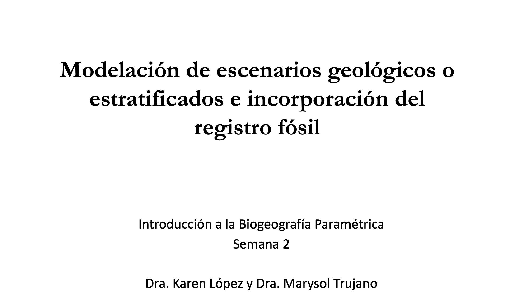

[{fig-align="center" width="500"}](../docs/u2_PatBio/IntroPatBio.pdf)

Haz clic en la imagen para ver el PDF de la presentación

[🔗 Ver video en YouTube](https://www.youtube.com/watch?v=Xi_K30bthv8&t=6067s)

## **Introducción**

Muchos procesos evolutivos fundamentales, como la adaptación, la especiación y la extinción, ocurren en un contexto espacial. Cuando no es posible observar directamente los aspectos históricos de este contexto espacial, como sucede en la mayoría de los casos, se pueden aplicar métodos de inferencia biogeográfica para estimar los rangos ancestrales de las especies.

Estos métodos combinan información filogenética, molecular y geográfica para modelar la distribución de especies como el resultado de procesos biogeográficos. Sin embargo, modelar estos procesos requiere de un análisis detallado, considerando aspectos como:

-   Cómo se heredan los rangos tras eventos de especiación.

-   Cómo los eventos geológicos pueden influir en las tasas de dispersión.

-   Qué factores afectan las tasas de dispersión y extirpación (extinción local).

Uno de los principales desafíos técnicos en la modelización de la evolución de rangos geográficos es traducir estos procesos naturales en procesos estocásticos que sean manejables en un contexto de inferencia. Este tutorial proporciona una introducción a algunos de estos modelos y describe cómo realizar una inferencia bayesiana de la biogeografía histórica utilizando el modelo de [**Dispersión-Extinción-Cladogénesis (DEC)** en RevBayes](https://revbayes.github.io/tutorials/biogeo/biogeo_intro.html).

## **Descripción del Modelo de Dispersión-Extinción-Cladogénesis (DEC)**

El modelo **DEC** modela la evolución de rangos como un proceso discreto (Ree et al. 2005; Ree y Smith 2008). Este modelo incluye tres componentes clave:

1.  **Caracteres de Rango:** Representación de la distribución de una especie como un conjunto de áreas discretas.

2.  **Evolución Anagenética del Rango:** Cambios en el rango geográfico dentro de una línea evolutiva antes de un evento de especiación.

3.  **Evolución Cladogenética del Rango:** Cambios en la distribución de la especie durante eventos de especiación.

A continuación, se presentan los posibles eventos modelados en DEC:

{fig-align="center" width="600"}

### **Eventos Anagenéticos (cambios dentro de una misma línea evolutiva):**

-   **(a) Dispersión:** Una especie expande su rango al colonizar una nueva área.

-   **(b) Extirpación (o extinción local):** Una especie pierde una de sus áreas previamente habitadas.

### **Eventos Cladogenéticos (cambios en la distribución durante la especiación):**

-   **(c) Simpatría restringida:** Si el ancestro estaba restringido a un solo territorio, ambas especies descendientes heredan esa misma área.

-   **(d) Simpatría parcial:** Si el ancestro tenía un rango amplio, una de las especies descendientes hereda el rango ancestral, mientras que la otra se restringe a una sola de sus áreas.

-   **(e) Alopatría (o vicarianza):** Si el ancestro tenía un rango amplio, cada especie descendiente hereda un subconjunto diferente de ese rango.

-   **(f) Simpatría generalizada:** Ambas especies descendientes heredan el mismo rango amplio del ancestro.

-   **(g) Dispersión por salto (o especiación fundadora):** Una especie descendiente hereda el rango ancestral mientras que la otra coloniza una nueva área previamente no ocupada.

Estos eventos permiten modelar de manera realista cómo evolucionan las distribuciones geográficas a lo largo del tiempo en un contexto filogenético.

## **Caracteres de Rango Discretos en el Modelo DEC**

El modelo **DEC** interpreta los rangos de los taxones como **datos de presencia-ausencia**. Es decir, representa en qué áreas una especie está presente o ausente a lo largo de múltiples regiones discretas.

Por ejemplo, supongamos que trabajamos con tres áreas geográficas: **A, B y C**.\
Si una especie se encuentra en las áreas **A y C**, su rango se puede representar como **AC**. Este rango se codifica mediante un **vector binario de longitud 3**, donde:

-   **1** indica presencia en un área.

-   **0** indica ausencia en un área.

Para el rango **AC**, la representación en bits sería `101`. Esta notación también puede transformarse en un número entero utilizando su representación binaria:

-   `101` en binario equivale a **5** en decimal.

### **Ejemplo de Representaciones Discretas de Rangos**

A continuación, se muestra cómo se representan distintos rangos para un análisis con tres áreas (**A, B y C**):

| **Rango** | **Bits** | **Número de áreas** | **Valor entero** |
|-----------|----------|---------------------|------------------|
| (vacío)   | `000`    | 0                   | 0                |
| A         | `100`    | 1                   | 1                |
| B         | `010`    | 1                   | 2                |
| C         | `001`    | 1                   | 3                |
| AB        | `110`    | 2                   | 4                |
| AC        | `101`    | 2                   | 5                |
| BC        | `011`    | 2                   | 6                |
| ABC       | `111`    | 3                   | 7                |

### **Evolución Anagenética del Rango en el Modelo DEC**

La **anagénesis** se refiere a la evolución de los rangos geográficos que ocurre **entre eventos de especiación**, es decir, dentro de una misma línea evolutiva.

Existen dos tipos principales de eventos anagenéticos:

1.  **Dispersión (Figura 1a):** Ocurre cuando una especie coloniza una nueva área.

2.  **Extirpación o extinción local (Figura 1b):** Ocurre cuando una especie pierde una de sus áreas previamente ocupadas.

Dado que el modelo DEC usa rangos discretos, la anagénesis se modela utilizando una **cadena de Markov de tiempo continuo (CTMC)**. En este modelo:

-   La probabilidad de que un rango cambie de estado (de $i$ a $j$) en un tiempo $t$ se calcula mediante **exponenciación de matrices**, según la ecuación:

    $$ P_{ij}(t) = [exp(Qt)]_{ij} $$

donde:

-   $Q$ es la **matriz de tasas instantáneas**, que define las tasas de cambio entre todos los pares de estados.

-   $P$ es la **matriz de probabilidad de transición**.

-   $i$ y $j$ representan diferentes rangos, los cuales se codifican como conjuntos de áreas ocupadas por una especie.

-   La probabilidad **integra todas las posibles trayectorias** de cambios de estado en el tiempo $t$.

## **Definición de la Matriz de Tasas (Q)**

Podemos definir la matriz $Q$ de anagénesis en términos de tasas de **extinción local (**$e$) y **dispersión (**$d$). Para tres áreas geográficas ($A$, $B$, $C$), la matriz de tasas de evolución anagenética tiene la siguiente estructura:

$$
Q =
\begin{array}{c|cccccccc}
   & \emptyset & A & B & C & AB & AC & BC & ABC \\
\hline
\emptyset & - & 0 & 0 & 0 & 0 & 0 & 0 & 0 \\
A & e_A & - & 0 & 0 & d_{AB} & d_{AC} & 0 & 0 \\
B & e_B& 0 & - & 0 & d_{BA} & 0 & d_{BC} & 0 \\
C & e_C & 0 & 0 & - & 0 & d_{CA} & d_{CB} & 0 \\
AB & 0 & e_B & e_A & 0 & - & 0 & 0 & d_{AC} + d_{BC} \\
AC & 0 & e_C & 0 & e_A & 0 & - & 0 & d_{AB} + d_{CB} \\
BC & 0 & 0 & e_C & e_B & 0 & 0 & - & d_{BA} + d_{CA} \\
ABC & 0 & 0 & 0 & 0 & e_C & e_B & e_A & - \\
\end{array}
$$

donde:

-   $e = (eA, eB, eC)$ representan las tasas de extinción local por área.

-   $d = (dAB, dAC, dBC, dBA, dCA, dCB)$ representan las tasas de dispersión entre pares de áreas.

-   **El rango vacío (**$∅$) es un estado absorbente: cualquier linaje que pierda todas sus áreas se mantiene en ese estado de manera permanente.

### 🧠 Construcción de una matriz de tasa DEC en RevBayes.

Ejecutar en `rb` los siguientes comandos:

Definir el número de áreas:

``` r
n_areas <- 3
```

## Anagenesis: Matriz de tasas $Q$

Matriz de dispersión:

``` r
for (i in 1:n_areas) {
    for (j in 1:n_areas) {
        dr[i][j] <- 1.0
    }
}
```

**¿Qué está haciendo este código?**

1.  Se define una **matriz cuadrada** de tamaño $3x3$ (porque hay 3 áreas).

2.  Se llena con $1.0$ en todas las posiciones $dr[i][j]$, lo que significa **que todas las áreas están conectadas por igual**.

3.  Se asume que la dispersión **no depende de la dirección** (`A → B` es igual que `B → A`).

**Matriz de dispersión:**

``` r
for (i in 1:n_areas) {
    for (j in 1:n_areas) {
        dr[i][j] <- 1.0
    }
}
```

**¿Qué está haciendo este código?**

1.  Se define una **matriz cuadrada** de tamaño $3x3$ (porque hay 3 áreas).

2.  Se llena con $1.0$ en todas las posiciones $dr[i][j]$, lo que significa **que todas las áreas están conectadas por igual**.

3.  Se asume que la dispersión **no depende de la dirección** (`A → B` es igual que `B → A`).

**Matriz de extirpación:**

``` r
for (i in 1:n_areas) {
    for (j in 1:n_areas) {
        er[i][j] <- 0.0
    }
    er[i][i] <- 1.0
}
```

**¿Qué está haciendo este código?**

1.  Se define una **matriz cuadrada** de tamaño $3x3$ (porque hay 3 áreas).

2.  Inicializa toda la matriz $er$ con 0.0 **(asumiendo que no hay extirpación entre diferentes áreas)**.

3.  Pone $1.0$ en la diagonal de la matriz $(A → ∅, B → ∅, C → ∅)$.

4.  Esto significa que cada área tiene una **tasa de extirpación de 1.0** por sí misma.

5.  **No hay extirpación cruzada** ($A → B$ no ocurre, solo $A → ∅$).

**Crear la matriz Q_DEC:**

Con las matrices `dr` y `er` creadas, ahora vas a construir la **matriz Q_DEC**, que define **las tasas de cambio entre todos los estados posibles de rango geográfico**.

``` r
Q_DEC := fnDECRateMatrix(dispersalRates=dr, extirpationRates=er)
Q_DEC
```

Esto hace lo siguiente:

-   Calcula automáticamente las **64 combinaciones** de transiciones posibles entre los **8 estados** (con 3 áreas, hay $2^3 = 8$ estados).

-   Llena la matriz `Q_DEC (8x8)` con tasas basadas en:

    -   La matriz de **dispersión** `dr`: para agregar áreas al rango actual.

    -   La matriz de **extirpación** `er`: para quitar áreas del rango actual.

**Crear la matriz de probabilidades de transición:**

``` r
tp_DEC <- Q_DEC.getTransitionProbabilities(rate=0.2)
tp_DEC
```

Estás calculando la matriz de probabilidades de transición a lo largo de una rama del árbol de longitud 0.2 unidades de tiempo (por ejemplo, millones de años).

**Veamos esta fila:**

| De `A` hacia...  | `A`   | `B`   | `C`   | `AB`  | `AC`  | `BC`  | `ABC` |
|------------------|-------|-------|-------|-------|-------|-------|-------|
| **Probabilidad** | 0.673 | 0.013 | 0.013 | 0.123 | 0.123 | 0.005 | 0.050 |

Esto responde: Si la especie está en `A`, qué tan probable es que termine en esos otros estados después de tiempo `t = 0.2`?

**En resumen**

| Comparación          | `Q_DEC`                         | `tp_DEC`                                  |
|------------------|------------------------|------------------------------|
| ¿Qué es?             | Matriz de tasas                 | Matriz de probabilidades                  |
| ¿Qué mide?           | Velocidad de cambio instantáneo | Probabilidad de cambio tras cierto tiempo |
| ¿Depende del tiempo? | ❌ No                           | ✅ Sí                                     |
| ¿Cómo se calcula?    | Directamente de `dr` y `er`     | Usando exp⁡(Q⋅t)exp(Q⋅t)                   |
| ¿Para qué se usa?    | Construir el modelo DEC         | Simular evolución, inferir cambios        |

## Codificar eventos cladogenéticos en DEC

Cuando una especie se divide en dos nuevas especies (cladogénesis), su rango geográfico también se hereda de diferentes formas.

``` r
clado_event_types = [ "s", "a" ]
clado_event_probs <- simplex( 1, 1 )
P_DEC := fnDECCladoProbs(eventProbs=clado_event_probs,
                         eventTypes=clado_event_types,
                         numCharacters=n_areas)
```

1.  `clado_event_types = [ "s", "a" ]`

Define **qué tipos de eventos cladogenéticos** vas a permitir en el modelo.

-   `"s"` = **Subset sympatry**\
    Una especie hereda **todo el rango**, la otra solo **una parte** (un área individual).\
    Ejemplo: `ABC → (ABC, A)`

-   `"a"` = **Allopatry**\
    El rango se **divide** en dos partes complementarias.\
    Ejemplo: `ABC → (AB, C)`

2.  `clado_event_probs <- simplex(1, 1)`

Esto crea un vector de **probabilidades normalizadas** (que suman 1).

📌 Como pusiste `1, 1`, estás diciendo:

-   `"s"` tendrá **50% de probabilidad**

-   `"a"` tendrá **50% de probabilidad**

💡 Si hubieras puesto `simplex(2, 1)`, la probabilidad sería:

-   `"s"` = 2/3

-   `"a"` = 1/3

3.  `P_DEC := fnDECCladoProbs(...)`

Esta función genera la **matriz de probabilidades cladogenéticas**, combinando los tipos de eventos (`"s"`, `"a"`) con sus probabilidades (`50%-50%`), para todos los **estados posibles** del rango, de acuerdo al número de áreas (`n_areas`).

📊 **¿Qué incluye `P_DEC`?**

Una matriz **sparse** (dispersa) donde cada fila representa:

`(estado_ancestral → sp_izquierda, sp_derecha) = probabilidad`

Ejemplo:

`(7 -> 7, 1) = 0.0833  # ABC → (ABC, A)  ← subset sympatry`

`(7 -> 6, 1) = 0.0833  # ABC → (AB, A)   ← allopatry`

`(7 -> 4, 3) = 0.0833  # ABC → (A, BC)   ← allopatry`

Como usaste `"s"` y `"a"` con probabilidades iguales, **se reparten equitativamente** entre todos los eventos posibles válidos bajo cada categoría.

### ⚠️ **Aspectos clave a considerar**

-   El modelo DEC escala **exponencialmente** con el número de áreas:

    -   $3$ áreas → 8×8 anagenético, $8^3 = 512$ eventos cladogenéticos

    -   $10$ áreas → $1024 × 1024$ (ya es muy pesado)

    -   $20$ áreas → ¡matrices enormes! No viable computacionalmente.

## Espadas plateadas (Tribu Madiinae), un grupo endémico de Hawái.

-   Un grupo joven (\~5 millones de años) y diverso de \~50 especies/subespecies

-   Se originaron en el continente (EE.UU. occidental), pero **radiaron en las islas hawaianas**

-   Son ideales para estudios porque:

    -   Las islas hawaianas se formaron de manera **cronológica** (K → O → M → H)

    -   Hay buen registro de distribución y filogenia.

    {fig-align="center" width="550"}

🗺️ **Áreas geográficas usadas**

Para simplificar, el tutorial usa solo **4 áreas** (con posibles combinaciones):

| Código binario | Áreas           | Tamaño | Estado (índice) |
|----------------|-----------------|--------|-----------------|
| `0000`         | Ninguna (∅)     | 0      | 0               |
| `1000`         | K (Kauai/Nihoa) | 1      | 1               |
| `0100`         | O (Oahu)        | 1      | 2               |
| `0010`         | M (Maui Nui)    | 1      | 3               |
| `0001`         | H (Hawai‘i)     | 1      | 4               |
| `1100`         | KO              | 2      | 5               |
| `1010`         | KM              | 2      | 6               |
| `0110`         | OM              | 2      | 7               |
| `1001`         | KH              | 2      | 8               |
| `0101`         | OH              | 2      | 9               |
| `0011`         | MH              | 2      | 10              |
| `1110`         | KOM             | 3      | 11              |
| `1101`         | KOH             | 3      | 12              |
| `1011`         | KMH             | 3      | 13              |
| `0111`         | OMH             | 3      | 14              |
| `1111`         | KOMH            | 4      | 15              |

📌 Cada uno de estos estados representa un **rango posible** que puede ocupar una especie.

**Descargar los archivos necesarios**

<a href="../docs/u2_PatBio/silversword.tre" download>📥 Descargar Árbol Filogenético</a>

<a href="../docs/u2_PatBio/silversword.n4.range.nex" download>📥 Descargar matriz de datos con los rangos codificados de cada especie.</a>

**Crea un scrip para RevBayes y copia el siguiente codigo.**

``` r
# definir rutas de los archivos y ruta de salida
range_fn = "../data/silversword.n4.range.nex"
tree_fn  = "../data/silversword.tre"
out_fn   = "../output/DEC/simple"

# leer datos de presencia-ausencia (binarios 0/1) de los rangos geográficos
dat_range_01 = readDiscreteCharacterData(range_fn)

# convertir los rangos binarios en números naturales (formato requerido por DEC)
dat_range_n = formatDiscreteCharacterData(dat_range_01, "DEC")

# comparar los caracteres (rangos) de dos taxones
dat_range_01[1]
dat_range_n[1]

# dimensiones de los datos (número de áreas y estados posibles)
n_areas  = dat_range_01.nchar()
n_states = floor(2^n_areas)

# obtener las descripciones de los estados convertidos
state_desc = dat_range_n.getStateDescriptions()

# escribir las descripciones de los estados en un archivo
state_desc_str = "state,range\n"
for (i in 1:state_desc.size())
{
    state_desc_str += (i-1) + "," + state_desc[i] + "\n"
}
write(state_desc_str, file=out_fn+".state_labels.txt")

# variables auxiliares (para guardar movimientos, monitores y número de generaciones)
moves = VectorMoves()
monitors = VectorMonitors()
n_gen = 3000

##################################
# Modelos del árbol filogenético #
##################################

# leer el árbol filogenético
tree <- readTrees(tree_fn)[1]

##########################
# Modelos biogeográficos #
##########################

# multiplicador de la tasa de eventos biogeográficos
rate_bg ~ dnLoguniform(1E-4,1E2)
rate_bg.setValue(1E-2)
moves.append( mvScale(rate_bg, weight=4) )

# tasa de dispersión relativa
dispersal_rate <- 1.0

# construir la matriz de tasas de dispersión relativa
for (i in 1:n_areas) {
    for (j in 1:n_areas) {
        dr[i][j] <- dispersal_rate
    }
}

# luego, definir la tasa de extirpación (extinción local) relativa por área
log_sd <- 0.5
log_mean <- ln(1) - 0.5*log_sd^2
extirpation_rate ~ dnLognormal(mean=log_mean, sd=log_sd)
moves.append( mvScale(extirpation_rate, weight=2) )

# construir la matriz de tasas de extirpación relativa
for (i in 1:n_areas) {
    for (j in 1:n_areas) {
        er[i][j] <- 0.0       
    }
    er[i][i] := extirpation_rate
}

# construir la matriz de tasas del modelo DEC (Q)
Q_DEC := fnDECRateMatrix(dispersalRates=dr,
                         extirpationRates=er)
                           
# construir la matriz de probabilidades de eventos cladogenéticos
clado_event_types <- [ "s", "a" ]
clado_event_probs <- simplex(1,1)
P_DEC := fnDECCladoProbs(eventProbs=clado_event_probs,
                         eventTypes=clado_event_types,
                         numCharacters=n_areas)

# modelo de cadena de Markov continua (CTMC) filogenética con eventos cladogenéticos
m_bg ~ dnPhyloCTMCClado(tree=tree,
                           Q=Q_DEC,
                           cladoProbs=P_DEC,
                           branchRates=rate_bg,
                           type="NaturalNumbers",
                           nSites=1)
    
# fijar (clamp) los datos observados de rangos al modelo
m_bg.clamp(dat_range_n)

#############
# Monitores #
#############

monitors.append( mnScreen(printgen=100, rate_bg) )
monitors.append( mnModel(file=out_fn+".model.log", printgen=10) )
monitors.append( mnFile(tree, filename=out_fn+".tre", printgen=10) )
monitors.append( mnJointConditionalAncestralState(tree=tree,
                                                  ctmc=m_bg,
                                                  type="NaturalNumbers",
                                                  withTips=true,
                                                  withStartStates=true,
                                                  filename=out_fn+".states.log",
                                                  printgen=10) )
monitors.append( mnStochasticCharacterMap(ctmc=m_bg,
                                          filename=out_fn+".stoch.log",
                                          printgen=100) )

############
# Análisis #
############

# construir el objeto de análisis del modelo a partir del grafo del modelo
mymodel = model(m_bg)

# crear el objeto de análisis MCMC
mymcmc = mcmc(mymodel, monitors, moves)

# ejecutar el análisis MCMC
mymcmc.run(n_gen)

# salir de revbayes
quit()
```

## **Procesar y visualizar los resultados**

Paso 1: Abre una nueva sesión de RevBayes y crea variables con los nombres de los archivos generados:

``` r
out_str = "../output/DEC/simple"
out_state_fn = out_str + ".states.log"   # Archivo con los estados ancestrales
out_tree_fn  = out_str + ".tre"          # Árboles muestreados del posterior
out_mcc_fn   = out_str + ".mcc.tre"      # Árbol de máxima credibilidad
```

Paso 2: Este paso **resume los árboles del posterior** (salvando la variabilidad) en **un solo árbol representativo**, útil para visualizar:

``` r
tree_trace = readTreeTrace(file=out_tree_fn, treetype="clock")  # Leer los árboles
tree_trace.setBurnin(0.25)          # Eliminar 25% como burn-in
n_burn = tree_trace.getBurnin()     # Guardar el número de árboles descartados
```

💡 Aunque en este análisis usaste un árbol fijo, este paso es **importante cuando el árbol se infiere** y varía entre muestras (ej. posterior bayesiano completo).

``` r
mcc_tree = mccTree(tree_trace, file=out_mcc_fn)  # Crear y guardar el árbol MCC
```

Paso 3: Cargar los estados ancestrales reconstruidos

``` r
state_trace = readAncestralStateTrace(file=out_state_fn)
```

Este archivo contiene las **probabilidades posteriores de los estados en los nodos** del árbol.

Paso 4: Cargar los árboles anotados con estados ancestrales

⚠️ Aquí es importante usar `readAncestralStateTreeTrace` y **no** `readTreeTrace`, para mantener las anotaciones:

``` r
tree_trace = readAncestralStateTreeTrace(file=out_tree_fn, treetype="clock")
```

Paso 5: Generar el árbol con estados ancestrales

``` r
anc_tree = ancestralStateTree(
    tree=mcc_tree,
    ancestral_state_trace_vector=state_trace,
    tree_trace=tree_trace,
    include_start_states=true,
    file=out_str + ".ase.tre",
    burnin=n_burn,
    site=1
)
```

## Graficar en R con RevGadgets

-   **Abre un editor de texto** (ejemplo *VSCode* )

-   **Copia y pega** exactamente el siguiente contenido

-   **Guarda el archivo** dentro de la carpeta de resultados de tu análisis DEC con el nombre \`range_colors.txt\`

``` r
range,color
"K","#7570b3"
"O","#e7298a"
"M","#66a61e"
"H","#e6ab02"
"KO","orchid"
"KM","firebrick3"
"OM","green"
"KH","cyan"
"OH","cadetblue3"
"MH","tomato"
"KOM","aquamarine2"
"KOH","#d95f02"
"KMH","royalblue"
"OMH","#666666"
"KOMH","darkviolet"
```

Este script define dos funciones auxiliares que se usan para **visualizar los resultados** de un análisis de biogeografía (por ejemplo, con el modelo DEC), específicamente para:

-   Mostrar los **estados ancestrales** como gráficos de pastel (pie charts) sobre el árbol filogenético.

-   Añadir **información geológica**, como los tiempos de formación de las islas hawaianas, sobre el eje temporal del árbol.

```{r}
# Cargar las bibliotecas necesarias
library(RevGadgets)
library(ggplot2)
library(ggtree)

# Función para añadir líneas verticales que marcan los tiempos de formación de las islas
add_island_times = function(p, x_offset) {
    t = "dashed"
    p = p + geom_vline(xintercept=x_offset-5.05, color="#7570b3", linetype=t)
    p = p + geom_vline(xintercept=x_offset-5.15, color="#7570b3", linetype=t)
    p = p + geom_vline(xintercept=x_offset-2.2, color="#e7298a", linetype=t)
    p = p + geom_vline(xintercept=x_offset-3.7, color="#e7298a", linetype=t)
    p = p + geom_vline(xintercept=x_offset-1.3, color="#66a61e", linetype=t)
    p = p + geom_vline(xintercept=x_offset-1.8, color="#66a61e", linetype=t)
    p = p + geom_vline(xintercept=x_offset-0.3, color="#e6ab02", linetype=t)
    p = p + geom_vline(xintercept=x_offset-0.7, color="#e6ab02", linetype=t)
    return(p)
}

# Función para construir etiquetas y colores de los estados ancestrales
make_states = function(label_fn, color_fn, fp="./") {

    # Leer la tabla de colores para cada rango geográfico
    range_color_list = read.csv(color_fn, header=T, sep=",", colClasses="character")

    # Extraer los nombres de las áreas individuales (por ejemplo: "K", "O", "M", "H")
    area_names = unlist(sapply(range_color_list$range, function(y) { if (nchar(y)==1) { return(y) } }))

    # Leer el archivo con las etiquetas de los estados codificados (binarios)
    state_descriptions = read.csv(label_fn, header=T, sep=",", colClasses="character")

    # Convertir los rangos codificados como "1010" en nombres como "KM"
    range_labels = sapply(state_descriptions$range[2:nrow(state_descriptions)],
        function(x) {
            present = as.vector(gregexpr(pattern="1", x)[[1]])
            paste( area_names[present], collapse="")
        })

    # Asignar un color a cada rango
    range_colors = range_color_list$color[ match(range_labels, range_color_list$range) ]

    # Generar listas con las etiquetas y los colores por estado
    idx = 1
    st_lbl = list()
    st_colors = c()
    for (j in 1:(nrow(state_descriptions)-1)) {
        st_lbl[[ as.character(j) ]] = range_labels[j]
        st_colors[j] = range_colors[j]
    }
    
    # Añadir color para estados misceláneos o desconocidos
    st_colors[ length(st_colors)+1 ] = "lightgray"
    st_lbl[["misc."]] = "misc."
    
    # Devolver etiquetas y colores
    return( list(state_labels=st_lbl, state_colors=st_colors) )
}
```

Este script en R **genera una figura** que muestra un árbol filogenético anotado con los **estados ancestrales geográficos**(rango de distribución de cada nodo) inferidos con el modelo DEC en RevBayes. Utiliza gráficos de pastel (pie charts) para representar **la incertidumbre en la reconstrucción** de rangos geográficos a lo largo del árbol evolutivo, y añade **información temporal sobre la formación de las islas hawaianas**.

```{r}
# nombres de archivo
# archivo de salida para la figura final en PDF
plot_fn = "../docs/u2_PatBio/output/DEC/simple.range.pdf" 
# árbol con estados ancestrales (generado en RevBayes)
tree_fn = "../docs/u2_PatBio/output/DEC/simple.ase.tre" 
# archivo con las etiquetas de los estados (rango binario → etiquetas)
label_fn = "../docs/u2_PatBio/output/DEC/simple.state_labels.txt"
# archivo con los colores para cada rango
color_fn = "../docs/u2_PatBio/output/DEC/range_colors.txt"

# obtener etiquetas de estado y colores de estado
states = make_states(label_fn, color_fn)
state_labels = states$state_labels
state_colors = states$state_colors

# procesar los estados ancestrales
ase <- processAncStates(tree_fn,
                        # Estas etiquetas numéricas deben coincidir con
                        # las del archivo original de datos de entrada.
                        state_labels = state_labels)

# graficar los estados ancestrales como gráficos de pastel (pie charts)
pp  <- plotAncStatesPie(t = ase,
                        # incluir los estados del nodo raíz
                         include_start_states=T, 
                        # mostrar etiquetas de los estados
                         state_labels=state_labels,
                        # asignar los colores definidos
                         state_colors=state_colors, 
                        # tamaño de las etiquetas en los extremos (tips)
                         tip_label_size=2.5,
                        # distancia de desplazamiento de las etiquetas
                         tip_label_offset=0.1,
                        # sin etiquetas numéricas en los nodos
                         node_label_size=0, 
                        # sin etiquetas en los hombros
                         shoulder_label_size=0, 
                        # mostrar leyenda de probabilidades posteriores
                         show_posterior_legend=T, 
                        # tamaño de los círculos en los extremos (tips)
                         tip_pie_diameter=0.5, 
                         # tamaño de los círculos en los nodos
                         node_pie_diameter=2.0,
                        # ajuste horizontal de los gráficos de pastel
                         pie_nudge_x=0.03, 
                        # ajuste vertical de los gráficos de pastel
                         pie_nudge_y=0.16, 
                         alpha=1) + # opacidad

  # mover la leyenda de estados
  theme(legend.position = c(0.1, 0.75))


# obtener las dimensiones del gráfico
 # obtener el valor máximo del eje x (altura del árbol)
x_phy = max(pp$data$x)
 # espacio extra para las etiquetas de las hojas
x_label = 3.5 
 # edad inicial del eje (debe ser mayor a la raíz del árbol)
x_start = 7  
# inicio del eje x
x0 = -(x_start - x_phy) 
# fin del eje x
x1 = x_phy + x_label 

# añadir eje cronológico
pp = pp + theme_tree2()
pp = pp + labs(x="Edad (Ma)")

# modificar límites del eje x
pp = pp + coord_cartesian(xlim=c(x0,x1), expand=TRUE)

# agregar marcas al eje y etiquetas de islas como eje secundario
island_axis = sec_axis(~ ., breaks=x_phy-c(5.1, 2.95, 1.55, 0.5), labels=c("+K","+O","+M","+H") )
x_breaks = seq(0,x_start,1) + x0
x_labels = rev(seq(0,x_start,1))
pp = pp + scale_x_continuous(breaks=x_breaks, labels=x_labels, sec.axis=island_axis)

# dibujar líneas verticales que marcan los tiempos de formación de islas
pp = add_island_times(pp, x_phy)

# configurar la posición de la leyenda
pp = pp + theme(legend.position="left")

# mostrar gráfico final
pp

# guardar el gráfico como archivo PDF
ggsave(file=plot_fn, plot=pp, device="pdf", height=7, width=10, useDingbats=F)
```
