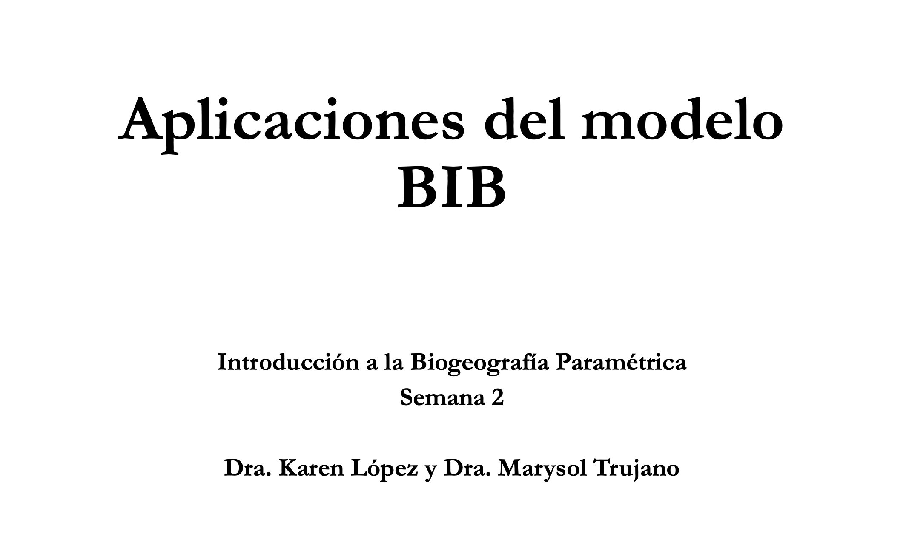

[{fig-align="center" width="500"}](../docs/u2_PatBio/BIB_Aplicaciones.pdf)

Haz clic en la imagen para ver el PDF de la presentación

[🔗 Ver video en YouTube](https://www.youtube.com/embed/dsZ2owt0iCE?si=sjS-YbDEXdrfrVhr)

## **Introducción**

En esta práctica, realizaremos un **análisis biogeográfico bayesiano** en **RevBayes** utilizando el **modelo BIB**, aplicado a un **conjunto de datos empíricos** compuesto por varios clados distribuidos en un **mismo conjunto de áreas geográficas**.

Como hemos aprendido en las clases, el modelo BIB incluye solo **dos componentes principales**:

-   Las **áreas discretas codificadas por presencia/ausencia**, que representan la distribución geográfica de los taxones.

-   El **componente anagenético**, descrito por la **matriz Q**, que modela las tasas de dispersión o migración entre áreas.

Es importante destacar que el modelo BIB **no incluye un componente cladogenético**, es decir, **no modela explícitamente escenarios de herencia de rangos durante los eventos de especiación**.

El objetivo principal de este análisis es estimar **patrones comunes en la evolución de los rangos geográficos**. En particular, buscamos responder la siguiente pregunta:

*¿Podemos inferir reglas generales sobre las tasas de dispersión entre áreas estimando dichas tasas en múltiples clados que comparten un mismo contexto biogeográfico?*

## Grupo de estudio

Trabajaremos con un conjunto de **nueve clados** distribuidos en las **Islas Canarias**, un archipiélago volcánico situado en el **océano Atlántico**, cerca del noroeste de África.

Estos clados (géneros, tribus o “alianzas genéricas”) **varían en el número de especies** y **pertenecen a distintos grupos taxonómicos**, como insectos, angiospermas y milípedos. Además, presentan **diferentes preferencias ecológicas**. A pesar de estas diferencias, **comparten una historia biogeográfica común**, ya que todos ellos están distribuidos—aunque no necesariamente de manera idéntica—**en el mismo conjunto de islas**.

Las **Islas Canarias** se formaron como resultado del **desplazamiento de la placa africana sobre un “punto caliente”**, una fuente persistente de magma localizada en el océano Atlántico. A diferencia de otros archipiélagos volcánicos formados por puntos calientes, como **Hawái**, la historia volcánica de las Canarias también estuvo influida por procesos **tectónicos continentales**, en particular por una fractura que se propagó desde la **cordillera del Atlas africano**.

Todas las islas emergieron durante los **últimos 20 millones de años**. Las islas orientales, como **Lanzarote y Fuerteventura**, son las más antiguas, mientras que las islas más occidentales, como **La Palma y El Hierro**, son las más recientes.

{fig-align="center" width="600"}

> Esta práctica se basa en la información presentada en: Sanmartín, I., Van Der Mark, P., & Ronquist, F. (2008). Inferring dispersal: A Bayesian approach to phylogeny‐based island biogeography, with special reference to the Canary Islands. *Journal of Biogeography*, 35(3), 428–449. https://doi.org/10.1111/j.1365-2699.2008.01885.x

## Descarga los conjuntos de datos

Revisa el contenido de cada uno de estos archivos. Notarás que, a diferencia del modelo **DEC**, el modelo **BIB trabaja directamente con alineamientos de secuencias de ADN**. Esto significa que en este análisis vamos a **inferir simultáneamente** la **filogenia** (las relaciones evolutivas entre especies) y los **patrones y tasas de evolución de los rangos geográficos**.

<a href="../docs/u2_PatBio/BIB/Bystropogon.nex1" download>🌿 Bystropogon</a>

<a href="../docs/u2_PatBio/BIB/Calathus.nex1" download>🪲 Calathus</a>

<a href="../docs/u2_PatBio/BIB/Dolichoiulus.nex1" download>🐛 Dolichoiulus</a>

<a href="../docs/u2_PatBio/BIB/Lotus.nex1" download>🌸 Lotus</a>

<a href="../docs/u2_PatBio/BIB/Micromeria.nex1" download>🌺 Micromeria</a>

<a href="../docs/u2_PatBio/BIB/Pimelia.nex1" download>🐞 Pimelia</a>

<a href="../docs/u2_PatBio/BIB/Psyllids.nex1" download>🪰 Psyllids</a>

Cada archivo `.nex` contiene **dos matrices**:

1.  La **primera matriz** incluye el **alineamiento de secuencias de ADN**, donde los estados de carácter son los nucleótidos (por ejemplo: A, C, T, G).

2.  La **segunda matriz** contiene los **estados biogeográficos**, codificados en una sola columna. Cada fila representa una especie (o un voucher de secuencia de ADN) y se codifica según su distribución geográfica.

## Codificación de áreas

La codificación de áreas sigue el esquema propuesto por **Sanmartín et al. (2008)**, el cual divide las Islas Canarias en **tres grupos geológicos** de islas. Esta clasificación se basa en las **pulsaciones geológicas** que dieron origen a las islas a lo largo de los últimos **20 millones de años**:

-   **Islas Orientales (1):** Lanzarote (15 Ma) y Fuerteventura (20 Ma)

-   **Islas Centrales (2):** Gran Canaria (14 Ma), Tenerife (12 Ma) y La Gomera (10 Ma)

-   **Islas Occidentales (3):** La Palma (2 Ma) y El Hierro (0.8 Ma)

Además, consideramos un **cuarto estado** para representar la **zona continental**, que puede actuar como fuente o destino de dispersión:

-   **Continente (0):** incluye la Península Ibérica, otros archipiélagos macaronésicos y el continente africano.

## Modelos bayesianos de islas

Cada **círculo** representa una isla; el **tamaño del círculo** indica su **capacidad de carga relativa** (es decir, el número esperado de linajes en equilibrio); el **grosor de las flechas** representa la **tasa relativa de dispersión** entre pares de islas.

{fig-align="center" width="500"}

Se muestran seis variantes del modelo:

-   **(a) Modelo Jukes–Cantor (JC):** todas las islas tienen igual capacidad de carga y todas las tasas de dispersión son iguales.

-   **(b) Modelo Equal-in:** las capacidades de carga son desiguales, pero las tasas de dispersión siguen siendo iguales.

-   **(c) Modelo GTR (General Time Reversible):** tanto las capacidades de carga como las tasas de dispersión son desiguales.

-   **(d) Variante Stepping-stone del modelo JC (JC step):** todas las islas tienen igual capacidad de carga, las tasas de dispersión son iguales pero **solo entre islas adyacentes**, siendo cero entre islas no adyacentes.

-   **(e) Equal-in step:** capacidades de carga desiguales, tasas de dispersión iguales entre islas adyacentes, cero entre islas no adyacentes.

-   **(f) GTR step:** capacidades de carga desiguales y tasas de dispersión también desiguales entre islas adyacentes, cero entre islas no adyacentes.

## Construcción de un análisis BIB utilizando el modelo GTR

En este paso, construimos el modelo molecular para cada clado de forma independiente utilizando un bucle. Cada grupo (o partición) de datos tiene su propia filogenia, tasa de sustitución, parámetros evolutivos y distribución de tasas entre sitios.

**¿Qué es la distribución Dirichlet?**

La **distribución Dirichlet** es una distribución de probabilidad para **proporciones** que deben **sumar 1**. Es decir, si tienes varios eventos (como frecuencias de nucleótidos o tasas de sustitución), y cada uno tiene un valor entre 0 y 1, la Dirichlet te da una forma de **asignar probabilidades a todas las combinaciones posibles** de esos valores **respetando que sumen 1**.

Piensa en ella como una **generalización de la distribución Beta**, que solo se aplica a dos proporciones (por ejemplo, éxito y fracaso).

{fig-align="center" width="600"}

**Script del modelo molecular**

Crea un archivo llamado `**bib_molecular.Rev**`.

Este script contiene la definición del **modelo molecular independiente para cada clado**, incluyendo la matriz de sustitución, la tasa de reloj, el modelo de árbol (birth-death), la heterogeneidad entre sitios, y los movimientos (moves) correspondientes.

``` r
# Este archivo procesa todos los conjuntos de datos de manera conjunta. 
# Asumimos que cada grupo tiene su propio modelo molecular, pero comparten el modelo biogeográfico.

# Asumimos que todos los datos moleculares y biogeográficos están contenidos 
# en un solo archivo por cada género. Los datos moleculares deben estar en 
# la primera matriz de datos en cada archivo, y los datos biogeográficos en 
# la segunda matriz. Los estados biogeográficos deben ser los mismos entre grupos.

# Leer todas las matrices de datos moleculares en el vector D
# Leer todas las matrices de datos biogeográficos en el vector B
# También se definen las calibraciones de edad para cada grupo

filenames <- [  "../data/BIB/Bystropogon.nex",
                "../data/BIB/Calathus.nex",
                "../data/BIB/Dolichoiulus.nex",
                "../data/BIB/Micromeria.nex",
                "../data/BIB/Lotus.nex",
                "../data/BIB/Pimelia.nex",
                "../data/BIB/Psyllids.nex"
              ]

# Bucle para leer cada archivo y separar sus dos matrices de datos
for ( i in 1:filenames.size() ){
    X <- readDiscreteCharacterData( filenames[i] )

    D[i] <- X[1]  # Primer bloque: datos moleculares
    B[i] <- X[2]  # Segundo bloque: datos biogeográficos
}

# Crear el vector de movimientos para el MCMC
moves = VectorMoves()

# Definir el modelo molecular para cada grupo
for ( i in 1:D.size() ) {

    # Definir priors para los elementos de la matriz de tasas de sustitución
    pi_M[i] ~ dnDirichlet( v(1,1,1,1) )             # Frecuencias de equilibrio de nucleótidos
    r_M[i]  ~ dnDirichlet( v(1,1,1,1,1,1) )         # Tasas de intercambio entre pares de nucleótidos

    # Definir la matriz de sustitución Q (nodo determinista)
    Q_M[i] := fnGTR( r_M[i], pi_M[i] )

    # Tasa de reloj molecular: prior exponencial con esperanza de 0.001
    # porque los datos son de cloroplastos, típicamente entre 1E-4 y 1E-3
    clockRate_M[i] ~ dnExponential( 1000.0 ) 

    # Definir parámetros previos del modelo de árbol (Birth-Death)

    # Prior para la tasa de diversificación
    # El valor esperado representa ~20 linajes en 3 millones de años (T = 3, r = 1)
    diversification[i] ~ dnExponential( 1.0 )

    # Prior no informativo para el turnover (extinción/especiación)
    turnover[i] ~ dnUniform(0.000001, 0.999999)

    # Conversión a parámetros subyacentes: lambda = especiación, mu = extinción
    lambda[i] := diversification[i] / abs(1.0 - turnover[i])
    mu[i]     := turnover[i] * lambda[i]

    # Prior para la edad de la raíz: entre 0 y 20 millones de años
    # Edad geológica del archipiélago canario (de El Hierro a Fuerteventura)
    rootAge[i] ~ dnUniform( 0.000001, 20.0 )

    # Definir el modelo completo del árbol filogenético para el grupo i
    tau[i] ~ dnBirthDeath(
        lambda = lambda[i],
        mu = mu[i],
        rootAge = rootAge[i],
        rho = 1.0,
        samplingStrategy = "uniform",
        condition = "time",
        taxa = D[i].taxa()
    )

    # Prior para la heterogeneidad entre sitios (distribución gamma)
    alpha_M[i] ~ dnExponential(1.0)

    # Cuatro cuantiles para la gamma discretizada
    probs <- v( 0.125, 0.375, 0.625, 0.875 )

    # Inicializar el vector de tasas por sitio
    siteRates_M[i] <- rep(0.0, 4)

    # Llenar el vector con tasas extraídas de una distribución gamma
    for ( j in 1:4 ) {
        siteRates_M[i][j] := qgamma( probs[j], alpha_M[i], alpha_M[i] )
    }

    # Definir el modelo completo de evolución de secuencias de ADN
    seq_M[i] ~ dnPhyloCTMC(
        tree        = tau[i],
        Q           = Q_M[i],
        branchRates = clockRate_M[i],
        siteRates   = siteRates_M[i],
        nSites      = D[i].nchar(),
        type        = "DNA"
    )

    # Fijar (clamp) el modelo a los datos observados
    seq_M[i].clamp( D[i] )

    # Añadir movimientos MCMC para explorar el espacio de parámetros
    moves.append(mvScale(clockRate_M[i], lambda=1, tune=true, weight=1))
    moves.append(mvScale(rootAge[i], lambda=1, tune=true, weight=1))
    moves.append(mvScale(diversification[i], lambda=1, tune=true, weight=1))
    moves.append(mvScale(turnover[i], lambda=1, tune=true, weight=1))
    moves.append(mvNNI(tau[i], weight=10.0))                     # Reordenamiento de nodos internos
    moves.append(mvFNPR(tau[i], weight=10.0))                    # Movimiento topológico
    moves.append(mvSubtreeScale(tau[i], weight=5.0))             # Escalado de subárbol
    moves.append(mvNodeTimeSlideUniform(tau[i], weight=10.0))    # Movimiento en tiempos de nodos
    moves.append(mvScale(alpha_M[i], lambda=1, tune=true, weight=1.0))  # Movimiento para alpha
}
```

**Script del modelo biogeográfico**

Crea un segundo archivo llamado `**bib_biogeo.Rev**`.

Este script carga el modelo molecular desde `bib_molecular.Rev` y define el **modelo biogeográfico compartido** entre todos los clados. Aquí se construye la matriz GTR biogeográfica (`Q_bio`), las capacidades de carga, las tasas de dispersión por clado, y se ejecuta la inferencia bayesiana.

``` r
# Definición del modelo biogeográfico BIB compartido por todos los clados

source("bib_molecular.Rev")  # Este script es el que contiene el modelo molecular definido previamente

# Asumimos los siguientes códigos de estados (indexados desde 0 en el archivo Nexus, desde 1 aquí):
# 0 → 1 Eastern Islands (Fuerteventura, Lanzarote)
# 1 → 2 Central Islands (Tenerife, Gran Canaria, La Gomera)
# 2 → 3 Western Islands  (El Hierro, La Palma)
# 3 → 4 Mainland (Península Ibérica, África, otras islas macaronésicas)

# Definir las capacidades de carga de las islas (π) y las tasas de dispersion (r)
pi_bio ~ dnDirichlet( v(1,1,1,1) )               # Prior Dirichlet plano para las frecuencias de área
r_bio  ~ dnDirichlet( v(1,1,1,1,1,1) )           # Prior Dirichlet plano para las tasas de dispersión

# Definir la matriz de tasas biogeográficas Q usando un modelo GTR
Q_bio := fnGTR( r_bio, pi_bio )

# La tasa de dispersion se define en unidades de tiempo;
# el prior se basa en asumir una tasa esperada de 1.0 eventos de dispersión por millón de años.
# Se quiere un prior relativamente vago, dada la incertidumbre.
# Usamos una distribución gamma(1,1), equivalente a una exponencial(1).
# El intervalo de credibilidad del 50% es (0.29, 1.39) y el del 95% es (0.025, 3.69)

moves = VectorMoves()           # Crear vector de movimientos
monitors = VectorMonitors()     # Crear vector de monitores

# Bucle para aplicar el modelo biogeográfico a cada clado
for ( i in 1:B.size() ) {

    migrationRates[i] ~ dnGamma( 1.0, 1.0 )  # Prior para la tasa de dispersión por clado

    # Definir el modelo de biogeografía para el clado i
    # Asume que los árboles tau están en unidades de tiempo
    bio[i] ~ dnPhyloCTMC(
        tree            = tau[i],
        Q               = Q_bio,
        rootFrequencies = pi_bio,
        branchRates     = migrationRates[i],
        nSites          = 1,
        type            = "Standard"
    )

    bio[i].clamp( B[i] )  # Anclar el modelo a los datos biogeográficos observados

    # Construir el modelo completo (sólo se requiere uno porque todos comparten Q_bio)
    mymodel = model( bio[1] )

    # Agregar movimientos para los parámetros biogeográficos (π, r y tasa de dispersión)
    # Asumimos que los movimientos del modelo molecular ya están definidos
    moves.append(mvSimplexElementScale(pi_bio, alpha=10.0, tune=true, weight=4.0))
    moves.append(mvSimplexElementScale(r_bio, alpha=10.0, tune=true, weight=6.0))
    moves.append(mvScale(migrationRates[i], lambda=1, tune=true, weight=1))
}

# Definir el nombre base para los archivos de salida
runName <- "biogeo_model"

# Definir monitores de salida para el modelo y para la pantalla

# Monitor que guarda los parámetros en archivo .csv
monitors.append(
    mnModel(
        filename = "../output/BIB/" + runName + ".csv",
        printgen = 10
    )
)

# Monitor que imprime en pantalla el valor de r_bio cada 100 generaciones
monitors.append(
    mnScreen(
        printgen = 100,
        r_bio
    )
)

# Ejecutar el MCMC
mymcmc = mcmc( mymodel, monitors, moves )
mymcmc.run(generations=5000)
```

▶️ Ejecución del análisis Una vez que hayas creado y guardado los scripts **bib_molecular.Rev** y **bib_biogeo.Rev**, puedes ejecutar el análisis completo desde la terminal utilizando el comando:

``` r
rb bib_biogeo.Rev
```

### 📊 Inspección de los resultados en **Tracer**

Al finalizar la ejecución del análisis, se generará un archivo `.csv` en la carpeta `output/BIB/` con los resultados del modelo (`biogeo_model.csv`).

Este archivo debe abrirse en el programa **Tracer** para visualizar los parámetros estimados y evaluar su convergencia y distribución posterior.

Entre los parámetros que podrás observar en Tracer están:

-   `pi_bio[1]` a `pi_bio[4]`: las **capacidades de carga** estimadas para cada área.

-   `r_bio[1]` a `r_bio[6]`: las **tasas de dispersión relativas** entre pares de áreas (modelo GTR).

-   `migrationRates[i]`: la tasa de dispersión estimada para cada clado.

### 🔎 Ejemplo: interpretación de `r_bio` según la tasa de sustitución nucleotídica

Recuerda que los parámetros en una distribución **Dirichlet** usada en modelos tipo GTR siguen un **orden predefinido**.\

Esto aplica tanto para modelos de sustitución nucleotídica como para modelos de dispersión entre áreas.

Por ejemplo, en un modelo GTR de **sustitución de nucleótidos**, los parámetros `r` se interpretan así:

1.  `r[1]` = A ⟷ C

2.  `r[2]` = A ⟷ G

3.  `r[3]` = A ⟷ T

4.  `r[4]` = C ⟷ G

5.  `r[5]` = C ⟷ T

6.  `r[6]` = G ⟷ T

De manera análoga, en el modelo BIB los parámetros `r_bio[1]` a `r_bio[6]` representan las **tasas de dispersión entre pares de áreas**, en un orden similar.

Aunque aquí no representen nucleótidos, la posición de cada parámetro en `r_bio` sigue el mismo esquema de codificación, por lo que es importante tenerlo en cuenta al interpretar los resultados.
