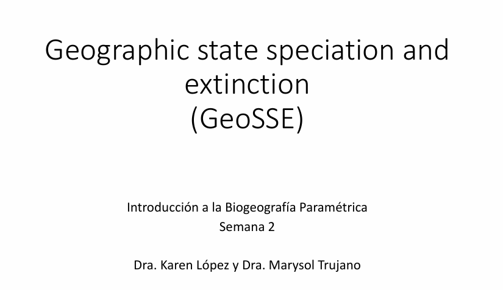

[{fig-align="center" width="500"}](../docs/u2_PatBio/GeoSSE_ClaSSE.pdf)

Haz clic en la imagen para ver el PDF de la presentación

## **Introducción**

El modelo **GeoSSE** (*Geographic State Speciation and Extinction*) es un modelo filogenético diseñado para estudiar cambios biogeográficos a lo largo del tiempo evolutivo ([Goldberg et al. 2011](https://academic.oup.com/sysbio/article/60/4/451/1611105?login=true)). Este modelo permite explorar cómo las tasas de diversificación (especiación y extinción) y de dispersión varían entre diferentes regiones geográficas.

En GeoSSE, el "estado" de un linaje representa su rango geográfico, el cual puede estar compuesto por una o más regiones discretas. Por ejemplo, en un escenario con dos regiones (A y B), hay tres rangos geográficos posibles: **A**, **B**, y **AB**.

Los linajes pueden dividirse y cambiar de estado a lo largo del tiempo evolutivo mediante cuatro procesos fundamentales:

1.  **Especiación entre regiones (b).-** Este evento ocurre cuando una especie con un rango amplio (por ejemplo, **AB**) se divide en dos especies, cada una ocupando una sola de las regiones. Por ejemplo, el ancestro con rango **AB** se divide en especies hijas con rangos **A** y **B**. Este proceso es **simétrico**: la separación entre **A y B** es equivalente a la separación entre **B y A**.

2.  **Dispersión entre regiones (d).-** La dispersión permite que una especie expanda su rango geográfico hacia una nueva región. La tasa de expansión es la **suma** de las tasas de dispersión entre cada par de regiones. Por ejemplo, una especie con rango **A** que se dispersa hacia **B** terminará con rango **AB**.

3.  **Especiación dentro de una región (w).-** Este evento genera dos linajes hijos, donde uno hereda **todo** el rango ancestral (que puede ser una o más regiones), y el otro hereda **una sola** región del rango ancestral. Por ejemplo, si la especie ancestral tenía el rango **AB**, una hija podría conservar **AB**, mientras que la otra tendría **A**.

4.  **Extinción local** (*extirpación*) **(e).-** La extinción hace que una especie pierda una región de su rango geográfico. Por ejemplo, una especie con rango **AB** puede extinguirse en la región **A**, quedando con rango **B**.

{fig-align="center" width="450"}

-   La **especiación dentro de una región** y la **especiación entre regiones** son procesos cladogenéticos que generan nuevos linajes filogenéticos. Estos eventos pueden resultar en especies hijas que ocupan rangos diferentes al de la especie ancestral.

-   La **extinción** y la **dispersión**, en cambio, son procesos anagenéticos que ocurren a lo largo de las ramas del árbol filogenético. La extinción y la especiación dentro de regiones ocurren en una sola región, mientras que la dispersión y la especiación entre regiones involucran dos o más regiones.

⚠️ **Nota:** El modelo estándar de GeoSSE **no permite** otros tipos de eventos evolutivos. Por ejemplo, **no se permite** que una especie ancestral con un rango amplio produzca dos hijas que **ambas conserven el rango completo** (es decir, no se permite especiación con simpatría total en rangos amplios). Además, GeoSSE solo permite que ocurra **un único evento** por instante de tiempo.

## Parámetros del modelo GeoSSE

El modelo **GeoSSE** permite que **cada región o par de regiones** tenga su propia tasa para cada uno de los procesos evolutivos.

Por ejemplo:

-   La tasa de **especiación dentro de la región A** puede ser distinta de la tasa de **especiación dentro de la región B**.

-   La tasa de **dispersión de A a B** no tiene por qué ser igual a la tasa de **dispersión de B a A**.

**Representación de las tasas en el modelo**

Al construir el modelo GeoSSE en RevBayes, representaremos estas tasas mediante vectores y matrices:

-   `rw`: **Vector de tasas de especiación dentro de cada región**

-   `re`: **Vector de tasas de extinción para cada región**

-   `rb`: **Matriz de tasas de especiación entre regiones**

-   `rd`: **Matriz de tasas de dispersión entre regiones**

**Diagrama de transición**

{fig-align="center" width="350"}

El diagrama de transición del modelo GeoSSE para **dos regiones** (basado en la Figura 1 de Goldberg et al. 2011) muestra:

-   Procesos **anagenéticos** (extinción y dispersión) representados con **flechas punteadas**.

-   Procesos **cladogenéticos** (especiación dentro y entre regiones) representados con **flechas continuas**.

Este esquema facilita visualizar cómo los linajes cambian de estado y cómo se forman nuevos linajes bajo diferentes escenarios geográficos.

## GeoSSE como modelo SSE

El modelo GeoSSE forma parte de una clase más amplia de modelos conocidos como **modelos SSE (State-dependent Speciation and Extinction)**. Estos modelos permiten que el **estado de un carácter discreto** (en este caso, el rango geográfico) influya en las tasas de:

-   Especiación

-   Extinción

-   Transición entre estados

Otros ejemplos importantes de modelos SSE incluyen:

-   [**BiSSE**](https://ib-unisse.github.io/patrones_filogeneticos/chapters/u1_intro_diversification_4.html): para caracteres binarios (e.g., presencia/ausencia de una característica)

-   [**ClaSSE**](https://revbayes.github.io/tutorials/sse/classe.html): permite cambios en el estado del carácter durante eventos de cladogénesis

El modelo GeoSSE es en realidad un caso especial del modelo ClaSSE, **estructurado y parametrizado específicamente para escenarios biogeográficos**.

## Aplicación del modelo GeoSSE en RevBayes

Este tutorial explica paso a paso cómo realizar un análisis GeoSSE en **RevBayes**. Utilizaremos como ejemplo el caso del género **Kadua**, distribuido en las islas de Hawái.\
En particular, se considerarán dos regiones:

-   **Islas antiguas**

-   **Islas jóvenes**

> 📝 **Nota**: Aunque este tutorial se basa en un análisis biogeográfico con dos regiones, el modelo está diseñado para ser **escalable a más regiones**. En general, [GeoSSE](https://revbayes.github.io/tutorials/geosse/) puede aplicarse hasta a 8 regiones (lo que implica 255 combinaciones posibles de rangos), aunque pueden requerirse **optimizaciones adicionales**.

En este caso, agrupar las islas hawaianas en solo dos categorías nos permite **enumerar fácilmente todas las tasas del modelo** y facilitar la implementación.

## 🐳 Usar Phylo_Docker

### 📥 Paso 1: Descargar la imagen según tu procesador

💻 Si estás en una **Mac con chip Apple (M1, M2, M3)**

Tu arquitectura es `arm64`. Ejecuta en la terminal:

``` bash
docker pull sswiston/phylo_docker:slim_arm64
```

🖥️ Si estás en una **PC con procesador Intel o AMD**

Tu arquitectura es `amd64` (también llamada `x86_64`). Ejecuta:

``` bash
docker pull sswiston/phylo_docker:slim_amd64
```

### 📥 Paso 2: Obtener los datos de la imagen Phylo_Docker

Conocer los datos de la imagen con el siguiente comando:

``` bash
docker images
```

-   **Imagen Docker**: `sswiston/phylo_docker`

-   **TAG**: `basic_arm64`

-   **ID de imagen**: `e7447322ee8d`

### 🚀 Paso 3: Ejecutar el contenedor con un volumen

Un **volumen** permite compartir archivos entre tu sistema operativo y el contenedor de Docker. En este caso, vas a montar la carpeta del proyecto en el contenedor para que puedas editar y guardar tus archivos desde afuera y usarlos dentro del contenedor.

Abre la Terminal y ejecuta:

``` bash
docker run -it --name phylodocker -v /Users/cristoichkov/Documents/patrones_filogeneticos:/home/patrones_filogeneticos sswiston/phylo_docker:slim_arm64 /bin/sh
```

**Esto te abrirá una terminal dentro del contenedor.**

🔍 Explicación parte por parte:

| Parte                              | Significado                                                    |
|---------------------------|---------------------------------------------|
| `docker run`                       | Ejecuta un nuevo contenedor                                    |
| `-it`                              | Modo interactivo + terminal (equivale a `--interactive --tty`) |
| `--name`                           | Asignar un nombre al contenedor                                |
| `-v /Users/pc:/home/contenedor`    | \[ruta_local\]:\[ruta_en_el_contenedor\]                       |
| `sswiston/phylo_docker:slim_arm64` | Imagen que vas a ejecutar `arm64` o `amd64`                    |
| `/bin/sh`                          | Ruta al programa shell estándar                                |

🔸 Para salir del contenedor:

``` bash
exit
```

▶️ Volver a entrar a un contenedor ya creado

1.- Verifica que el contenedor existe:

``` bash
docker ps -a
```

2.- Inicia el contenedor de nuevo:

``` bash
docker start -ai phylodocker
```

-   `-a` lo adjunta a la terminal

-   `-i` lo pone en modo interactivo

⏹️ Para detener un contenedor:

``` bash
docker stop phylodocker
```

🧽 Para **eliminar** un contenedor:

Antes de poder borrar una imagen, debes eliminar **todos los contenedores** que la usen. Eliminar el contenedor:

``` bash
docker rm phylodocker
```

🗑️ Para eliminar una **imagen Docker**:

1.  Verifica imágenes disponibles:

``` bash
docker images
```

2.  Elimina la imagen:

``` bash
docker rmi sswiston/phylo_docker:basic_arm64
```

## 🚀 GeoSSE en RevBayes

### 📂 1. Archivos necesarios

Descarga y guarda los archvios en tu carpeta de proyecto

-   <a href="../docs/u2_PatBio/geosse/kadua.tre" download>Árbol filogenético calibrado</a>

-   <a href="../docs/u2_PatBio/geosse/kadua_range_n2.nex" download>Matriz de presencia/ausencia por región</a>

-   <a href="../docs/u2_PatBio/geosse/geosse.Rev" download>Script GeoSSE</a>

### 🚪 2. Iniciar (o reingresar) al contenedor

Si el contenedor ya existe pero está detenido, puedes **volver a entrar** con:

``` bash
docker start -ai phylodocker
```

### 🏠 3. Navega a la carpeta donde está tu script

Ya dentro del contenedor, ve a la carpeta donde guardaste el script `.Rev`. Por ejemplo:

``` bash
cd /home/patrones_filogeneticos/scripts
```

### 📜 4. Correr el script `.Rev` desde RevBayes

Una vez dentro de la carpeta de scripts, ejecuta:

``` bash
rb geosse.Rev
```

## 🧬 Código en R para graficar

```{r, results='hide'}
# Cargar las librerías necesarias
library(RevGadgets)
library(ggplot2)

# Ruta al árbol con estados ancestrales
tree_file <- "../docs/u2_PatBio/geosse/out/ase.tre"

# Leer los estados ancestrales e interpretar los valores
states <- processAncStates(tree_file, 
                           state_labels = c("0" = "Islas antiguas", 
                                            "1" = "Islas jóvenes", 
                                            "2" = "Ambas regiones"))

# Graficar los estados ancestrales más probables (MAP)
plotAncStatesMAP(t = states,
                 node_size = 2,
                 node_size_as = NULL) +
  ggplot2::theme(legend.position = "bottom",
                 legend.title = element_blank())
```
