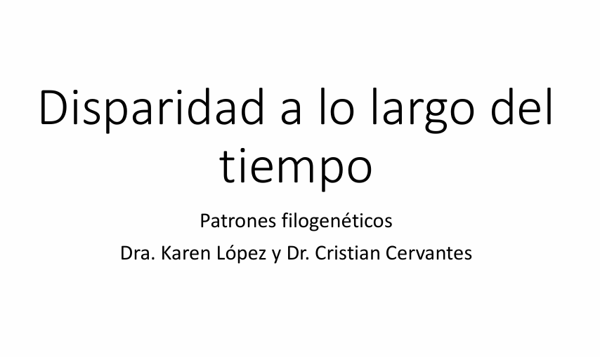

[{fig-align="center" width="500"}](../docs/u3_PatMorph/DTT_Coevol.pdf)

Haz clic en la imagen para ver el PDF de la presentación

## Análisis de Disparity-Through-Time (DTT) con geiger en R

En biología evolutiva, el término disparidad describe la variación morfológica o funcional entre especies dentro de un clado. A diferencia de la diversidad taxonómica (cuántas especies hay), la disparidad nos dice cuán distintas son las especies entre sí en cuanto a rasgos cuantitativos.

El análisis de Disparity-Through-Time (DTT) permite rastrear cómo esta disparidad ha cambiado a lo largo de la historia evolutiva de un grupo. Es una herramienta útil para identificar patrones como radiaciones adaptativas (alta disparidad al inicio) o conservadurismo morfológico (baja disparidad durante la evolución).

El paquete geiger en R ofrece la función dtt() para realizar este tipo de análisis comparando la trayectoria empírica de la disparidad con simulaciones bajo un modelo de evolución neutral (modelo Browniano, por defecto).

### ¿Qué hace la función `dtt()`?

La función `dtt()` toma un árbol filogenético y una matriz de rasgos cuantitativos, y calcula:

-   La **disparidad promedio** en diferentes puntos del tiempo evolutivo.

-   Un conjunto de simulaciones bajo evolución Browniana para comparar con los datos reales.

-   El **índice MDI** (*Morphological Disparity Index*), que resume si la disparidad observada es mayor o menor que la esperada bajo el modelo nulo.

### ¿Qué devuelve `dtt()`?

La función `dtt()` retorna una lista con los siguientes elementos:

-   `dtt`: Disparidad promedio para los clados.

-   `times`: Tiempos correspondientes a cada valor de disparidad en el análisis DTT.

-   `sim`: Valores de disparidad a lo largo del tiempo para cada uno de los datasets simulados bajo el modelo nulo.

-   `MDI`: Valor del **Morphological Disparity Index**, que corresponde al área entre la curva DTT empírica y la mediana de las curvas simuladas.

Descarga del Árbol Filogenético y la matriz de caracteres continuos

📥 Puedes descargar el archivo .tre con el árbol en el siguiente enlace:

<a href="../docs/u1_PatDiv/output/morpho/subarbol_ingroup_morph.nex" download>📥 Descargar árbol filogenético</a>

📥 Puedes descargar el archivo .nex con la matriz de caracteres continuos en el siguiente enlace:

<a href="../docs/u1_PatDiv/output/morpho/med_geiger.nex" download>📥 Descargar matriz de caracteres continuos</a>

Guarda los archivos en la carpeta correspondiente y verifica su ubicación antes de continuar.

```{r}
# --------------------------------------
# Análisis Disparity-Through-Time (DTT)
# Variable: Volumen de Élitros
# --------------------------------------

# 📦 Cargar paquetes necesarios
library(geiger)   # para el análisis DTT
library(ape)      # para leer árboles filogenéticos en formato NEXUS
library(ggplot2)  # para graficar con estilo profesional
library(dplyr)    # para manipulación de datos
library(tidyr)    # para transformación de datos en formato largo

# 🌳 Leer el árbol filogenético en formato NEXUS
tree <- read.nexus("../docs/u3_PatMorph/subarbol_ingroup_morph.nex")

# 📊 Leer la matriz de rasgos continuos (NEXUS como tabla de texto)
data_df <- read.table("../docs/u3_PatMorph/med_geiger.nex", 
                      skip = 6,    # omitir cabecera hasta el bloque MATRIX
                      nrows = 21,  # número de taxones
                      fill = TRUE, 
                      stringsAsFactors = FALSE)

# 🏷️ Asignar nombres a las columnas de la matriz
colnames(data_df) <- c("taxa", "v_elitros", "v_abdomen", "amplitud", "convexidad")

# 🧬 Extraer la variable 'v_elitros' y asignar nombres
v_elitros <- data_df$v_elitros
names(v_elitros) <- data_df$taxa

# 🧪 Ejecutar análisis DTT con 1000 simulaciones bajo evolución Browniana
dtt_v_elitros <- geiger::dtt(
  tree,
  v_elitros,
  calculateMDIp = TRUE,      # calcula el p-valor empírico
  plot=FALSE,
  mdi.range = c(0, 1),       # usa toda la profundidad del árbol
  nsim = 1000                # número de simulaciones
)

# 📉 Extraer resultados del análisis
mdi_val <- as.numeric(dtt_v_elitros$MDI)     # valor del índice MDI
p_val   <- dtt_v_elitros$MDIp                # p-valor empírico
empirical <- dtt_v_elitros$dtt               # curva de disparidad observada
sim_df <- as.data.frame(dtt_v_elitros$sim)   # disparidad simulada
sim_df$time <- dtt_v_elitros$times           # tiempos de ramificación

# 🔄 Reorganizar las simulaciones a formato largo (long format)
sim_df_long <- sim_df %>%
  pivot_longer(cols = -time, names_to = "rep", values_to = "disparity") %>%
  mutate(type = "Simulated")

# 🔵 Crear data frame para la curva observada
emp_df <- data.frame(
  time = dtt_v_elitros$times,
  disparity = dtt_v_elitros$dtt,
  type = "Empirical"
)

# 📊 Calcular resumen estadístico de las simulaciones (mediana y percentiles)
summary_df <- sim_df %>%
  pivot_longer(cols = -time, names_to = "rep", values_to = "disparity") %>%
  group_by(time) %>%
  summarise(
    median = median(disparity),
    lower = quantile(disparity, 0.025),
    upper = quantile(disparity, 0.975)
  )

# 📈 Graficar resultado del análisis DTT con ggplot2
ggplot() +
  # Sombreado gris para el intervalo de simulaciones (2.5% - 97.5%)
  geom_ribbon(data = summary_df, aes(x = time, ymin = lower, ymax = upper),
              fill = "gray80", alpha = 0.5) +
  
  # Línea discontinua: mediana de simulaciones
  geom_line(data = summary_df, aes(x = time, y = median),
            linetype = "dashed", color = "gray12", size = 0.8) +
  
  # Línea azul sólida: trayectoria empírica de disparidad
  geom_line(data = emp_df, aes(x = time, y = disparity),
            color = "dodgerblue", size = 1) +
  
  # 🧾 Texto con valores de MDI y p-value en la esquina superior derecha
  annotate("text",
           x = 0.98,
           y = max(summary_df$upper, na.rm = TRUE),
           hjust = 1,
           label = paste0(
             "MDI = ", round(mdi_val, 6), "\n",
             "p-value = ", signif(p_val, 3)
           ),
           size = 4.5) +
  
  # Títulos y etiquetas de ejes
  labs(
    title = "Volumen de Élitros",
    x = "Relative Time", y = "Disparity"
  ) +
  theme_minimal(base_size = 14)  # Tema limpio y legible

```

🔎 dtt_res\$MDI: Morphological Disparity Index ¿Qué es? Es un índice resumen que mide cuán diferente es la trayectoria de disparidad observada a lo largo del tiempo en comparación con lo que esperaríamos bajo un modelo nulo de evolución (típicamente, modelo Browniano).

¿Cómo se interpreta? Esencialmente, mide el área entre la curva empírica de disparidad y la mediana de las curvas simuladas.

Valor positivo: la disparidad se acumuló más tempranamente que lo esperado.

Puede sugerir una radiación adaptativa temprana.

Valor negativo: la disparidad se acumuló más tardíamente de lo esperado.

Puede indicar conservadurismo morfológico temprano, o una diversificación más reciente de formas.

📊 dtt_res\$MDIp: p-valor empírico del MDI ¿Qué es? Es la proporción de simulaciones en las que el valor de MDI fue igual o más extremo (en valor absoluto) que el MDI observado.

¿Cómo se interpreta? Este valor te dice si el patrón de disparidad observado se desvía significativamente de lo que esperaríamos por azar bajo evolución neutral.

p \< 0.05: resultado significativo → la trayectoria observada no es compatible con el modelo Browniano (hay señal de evolución no neutral).

p ≥ 0.05: no hay suficiente evidencia para rechazar el modelo nulo.

## Correlación entre caracteres morfológicos discretos

Evaluaremos la correlación entre caracteres morfológicos discretos en un contexto filogenético siguiendo el tutorial de [RevBayes](https://revbayes.github.io/tutorials/morph_ase/corr.html). Utilizaremos un conjunto de datos de primates que incluye varios caracteres codificados como binarios, tales como: **periodo de actividad, tipo de hábitat, comportamiento solitario, uso del sustrato terrestre, número de machos por grupo, sistema de apareamiento y tipo de dieta**. Algunos de estos caracteres pueden estar evolutivamente correlacionados —por ejemplo, el tipo de hábitat y el uso del sustrato terrestre—, pero ¿cómo podemos probar estadísticamente si esta dependencia existe?

Para probar si dos caracteres discretos binarios (por ejemplo, *hábitat* y *uso del sustrato terrestre*) están correlacionados en su evolución, combinamos ambos caracteres en un solo carácter con **cuatro estados posibles**:

-   `00`: A = 0, B = 0

-   `01`: A = 0, B = 1

-   `10`: A = 1, B = 0

-   `11`: A = 1, B = 1

### 🔹 Matriz de evolución independiente

Esta matriz modela dos caracteres **A** y **B** que evolucionan de manera **independiente**, con sus respectivas tasas de ganancia ($\alpha$) y pérdida ($\beta$).

$$
Q =
\begin{array}{c|cccc}
     & 00 & 10 & 01 & 11 \\
\hline
00 & -    & \alpha_A & \alpha_B & 0 \\
10 & \beta_A & -    & 0 & \alpha_B \\
01 & \beta_B & 0 & -    & \alpha_A \\
11 & 0 & \beta_A & \beta_B & -
\end{array}
$$

------------------------------------------------------------------------

### 🔸 Matriz de evolución correlacionada

Aquí permitimos que la tasa de cambio de un carácter **dependa del estado del otro carácter**, resultando en 8 parámetros independientes $\mu_{i,j}$.

$$
Q =
\begin{array}{c|cccc}
     & 00 & 10 & 01 & 11 \\
\hline
00 & -     & \mu_{1,2} & \mu_{1,3} & 0 \\
10 & \mu_{2,1} & -     & 0 & \mu_{2,4} \\
01 & \mu_{3,1} & 0 & -     & \mu_{3,4} \\
11 & 0 & \mu_{4,2} & \mu_{4,3} & -
\end{array}
$$

------------------------------------------------------------------------

## Interpretación

Cada fila y columna corresponde a los estados `00`, `10`, `01`, `11`, respectivamente. Por ejemplo:

-   $\mu_{1,2}$ representa la transición de `00` a `10` (ganancia de A cuando B=0),
-   $\mu_{3,4}$ representa la transición de `01` a `11` (ganancia de A cuando B=1).

**Hipótesis evolutiva:** La locomoción terrestre (A=1) podría haber evolucionado con mayor probabilidad en especies que ya habitaban entornos abiertos (B=1), donde moverse por el suelo puede ser más eficiente o seguro. Por lo tanto, si $\mu_{1,2} \ne \mu_{3,4}$ entonces la ganancia del carácter "terrestre" depende del estado del hábitat, lo que sugiere una correlación evolutiva entre ambos caracteres.

Comparando pares de parámetros podemos evaluar si hay dependencia:

| Comparación               | ¿Qué se prueba?                             |
|---------------------------|---------------------------------------------|
| $\mu_{1,2} \ne \mu_{3,4}$ | Si la ganancia de A depende del estado de B |
| $\mu_{2,1} \ne \mu_{4,3}$ | Si la pérdida de A depende del estado de B  |
| $\mu_{1,3} \ne \mu_{2,4}$ | Si la ganancia de B depende del estado de A |
| $\mu_{3,1} \ne \mu_{4,2}$ | Si la pérdida de B depende del estado de A  |

Realizaremos estas pruebas utilizando un enfoque bayesiano basado en **cadenas de Markov con salto reversible** (*Reversible Jump Markov Chain Monte Carlo*, RJ-MCMC). Este método permite explorar modelos con diferente número de parámetros y estimar directamente si ciertas tasas de transición entre caracteres son estadísticamente distinguibles —es decir, si hay **correlación evolutiva** entre caracteres.

Descarga del Árbol Filogenético y la matriz de caracteres discretos

📥 Puedes descargar el archivo .tre con el árbol en el siguiente enlace:

<a href="../docs/u3_PatMorph/primates_tree.nex" download>📥 Descargar árbol filogenético</a>

📥 Puedes descargar los archivos .nex con las matrices de caracteres discretos en el siguiente enlace:

<a href="../docs/u3_PatMorph/primates_solitariness.nex" download>📥 Descargar matriz de caracteres discretos "solitariness"</a>

<a href="../docs/u3_PatMorph/primates_terrestrially.nex" download>📥 Descargar matriz de caracteres discretos "terrestrially"</a>

Guarda los archivos en la carpeta correspondiente y verifica su ubicación antes de continuar.

``` r
################################################################################
# Ejemplo en RevBayes: Prueba de correlación entre caracteres discretos
# Autor: Sebastian Höhna 
################################################################################

#######################
# Cargar los datos
#######################

# Nombres de los caracteres a comparar
CHARACTER_A = "solitariness"
CHARACTER_B = "terrestrially"

# Ambos caracteres son binarios
NUM_STATES_A = 2
NUM_STATES_B = 2

# Leer los datos morfológicos desde archivos NEXUS
morpho_A <- readDiscreteCharacterData("../data/primates_"+CHARACTER_A+".nex")
morpho_B <- readDiscreteCharacterData("../data/primates_"+CHARACTER_B+".nex")

# Combinar los dos caracteres en uno compuesto con 4 estados: 00, 01, 10, 11
morpho = combineCharacter( morpho_A, morpho_B )

# Inicializar los vectores de movimientos y monitores
moves    = VectorMoves()
monitors = VectorMonitors()

##############
# Modelo de árbol
##############

# Usamos una topología fija para el árbol filogenético de primates
phylogeny <- readTrees("../data/primates_tree.nex")[1]

#########################
# Modelo de tasas (matriz Q)
#########################

# Asumimos que todas las tasas de cambio son independientes y tienen distribución exponencial
rate_pr := phylogeny.treeLength() / 10

# Inicializar la matriz de tasas (4x4) con ceros
for (i in 1:4) {
    for (j in 1:4) {
        rates[i][j] <- 0.0
    }
}

# Mezcla para el modelo con salto reversible (Reversible Jump MCMC)
mix_prob <- 0.5

# Definir las tasas de ganancia y pérdida para cada carácter condicionado al estado del otro
# A depende de B
rate_gain_A_when_B0 ~ dnExponential( rate_pr )
rate_gain_A_when_B1 ~ dnReversibleJumpMixture(rate_gain_A_when_B0, dnExponential( rate_pr ), mix_prob)
rate_loss_A_when_B0 ~ dnExponential( rate_pr )
rate_loss_A_when_B1 ~ dnReversibleJumpMixture(rate_loss_A_when_B0, dnExponential( rate_pr ), mix_prob)

# B depende de A
rate_gain_B_when_A0 ~ dnExponential( rate_pr )
rate_gain_B_when_A1 ~ dnReversibleJumpMixture(rate_gain_B_when_A0, dnExponential( rate_pr ), mix_prob)
rate_loss_B_when_A0 ~ dnExponential( rate_pr )
rate_loss_B_when_A1 ~ dnReversibleJumpMixture(rate_loss_B_when_A0, dnExponential( rate_pr ), mix_prob)

# Variables lógicas para saber si las tasas son iguales (sirve para resumir posterior)
prob_gain_A_indep := ifelse( rate_gain_A_when_B0 == rate_gain_A_when_B1, 1.0, 0.0 )
prob_loss_A_indep := ifelse( rate_loss_A_when_B0 == rate_loss_A_when_B1, 1.0, 0.0 )
prob_gain_B_indep := ifelse( rate_gain_B_when_A0 == rate_gain_B_when_A1, 1.0, 0.0 )
prob_loss_B_indep := ifelse( rate_loss_B_when_A0 == rate_loss_B_when_A1, 1.0, 0.0 )

# Agregar los movimientos para ajustar las tasas
moves.append( mvScale( rate_gain_A_when_B0, weight=2 ) )
moves.append( mvScale( rate_gain_A_when_B1, weight=2 ) )
moves.append( mvScale( rate_loss_A_when_B0, weight=2 ) )
moves.append( mvScale( rate_loss_A_when_B1, weight=2 ) )
moves.append( mvScale( rate_gain_B_when_A0, weight=2 ) )
moves.append( mvScale( rate_gain_B_when_A1, weight=2 ) )
moves.append( mvScale( rate_loss_B_when_A0, weight=2 ) )
moves.append( mvScale( rate_loss_B_when_A1, weight=2 ) )

# Movimientos para permitir o no la diferenciación entre tasas (Reversible Jump)
moves.append( mvRJSwitch(rate_gain_A_when_B1, weight=2.0) )
moves.append( mvRJSwitch(rate_loss_A_when_B1, weight=2.0) )
moves.append( mvRJSwitch(rate_gain_B_when_A1, weight=2.0) )
moves.append( mvRJSwitch(rate_loss_B_when_A1, weight=2.0) )

# Asignar las tasas a la matriz Q
rates[1][2] := rate_gain_A_when_B0  # 00 → 10
rates[1][3] := rate_gain_B_when_A0  # 00 → 01
rates[2][1] := rate_loss_A_when_B0  # 10 → 00
rates[2][4] := rate_gain_B_when_A1  # 10 → 11
rates[3][1] := rate_loss_B_when_A0  # 01 → 00
rates[3][4] := rate_gain_A_when_B1  # 01 → 11
rates[4][2] := rate_loss_B_when_A1  # 11 → 10
rates[4][3] := rate_loss_A_when_B1  # 11 → 01

# Definir matriz Q final
Q_morpho := fnFreeK(rates, rescaled=FALSE)

#####################################
# Frecuencias de estado raíz
#####################################

rf_prior <- rep(1, NUM_STATES_A * NUM_STATES_B)
rf ~ dnDirichlet(rf_prior)

# Movimientos para explorar las frecuencias de raíz
moves.append( mvBetaSimplex(rf, weight=2) )
moves.append( mvDirichletSimplex(rf, weight=2) )

##########################
# Modelo CTMC completo
##########################

# Definir modelo de carácter morfológico sobre el árbol
phyMorpho ~ dnPhyloCTMC(tree=phylogeny, Q=Q_morpho, rootFrequencies=rf, type="NaturalNumbers")
phyMorpho.clamp(morpho)

########
# MCMC #
########

# Crear el modelo
mymodel = model(phylogeny)

# Monitores de salida
monitors.append( mnModel(filename="../out/RJ/"+CHARACTER_A+"_"+CHARACTER_B+"_corr_RJ.log", printgen=1) )
monitors.append( mnScreen(printgen=100) )
monitors.append( mnJointConditionalAncestralState(tree=phylogeny,
                                                  ctmc=phyMorpho,
                                                  filename="../out/RJ/"+CHARACTER_A+"_"+CHARACTER_B+"_corr_RJ.states.txt",
                                                  type="NaturalNumbers",
                                                  printgen=1,
                                                  withTips=true,
                                                  withStartStates=false) )
monitors.append( mnStochasticCharacterMap(ctmc=phyMorpho,
                                          filename="../out/RJ/"+CHARACTER_A+"_"+CHARACTER_B+"_corr_RJ_stoch_char_map.log",
                                          printgen=1,
                                          include_simmap=true) )

# Configurar MCMC
mymcmc = mcmc(mymodel, monitors, moves, nruns=2, combine="mixed")

# Ejecutar el análisis
mymcmc.run(generations=5000, tuningInterval=200)

#############################
# Reconstrucción ancestral
#############################

# Leer resultados de estados ancestrales condicionales
anc_states = readAncestralStateTrace("../out/RJ/"+CHARACTER_A+"_"+CHARACTER_B+"_corr_RJ.states.txt")
anc_tree = ancestralStateTree(tree=phylogeny,
                              ancestral_state_trace_vector=anc_states,
                              include_start_states=false,
                              file="../out/RJ/"+CHARACTER_A+"_"+CHARACTER_B+"_ase_corr_RJ.tree",
                              burnin=0.25,
                              summary_statistic="MAP",
                              site=1,
                              nStates=NUM_STATES_A * NUM_STATES_B)

# Leer historias de carácter simuladas (stochastic mapping)
anc_states_stoch_map = readAncestralStateTrace("../out/RJ/"+CHARACTER_A+"_"+CHARACTER_B+"_corr_RJ_stoch_char_map.log")

# Crear árboles resumen de mapeo estocástico
char_map_tree = characterMapTree(tree=phylogeny,
                 ancestral_state_trace_vector=anc_states_stoch_map,
                 character_file="../out/RJ/"+CHARACTER_A+"_"+CHARACTER_B+"_corr_RJ_marginal_character.tree",
                 posterior_file="../out/RJ/"+CHARACTER_A+"_"+CHARACTER_B+"_corr_RJ_marginal_posterior.tree",
                 burnin=0.25,
                 num_time_slices=500)

# Salir de RevBayes
q()
```

```{r}
################################################################################
# Script en R para graficar estados ancestrales inferidos
# mediante un modelo CTMC correlacionado en RevBayes
# Autor original: Sebastian Höhna
################################################################################

# Cargar librerías necesarias
library(RevGadgets)
library(ggplot2)

# Nombres de los caracteres utilizados en el análisis
CHARACTER_A <- "solitariness"
CHARACTER_B <- "terrestrially"

# Etiquetas para los estados combinados: 00, 01, 10, 11
STATE_LABELS <- c(
  "0" = "grupo - arborícola",
  "1" = "grupo - terrestre",
  "2" = "solitario - arborícola",
  "3" = "solitario - terrestre"
)

# Leer archivo de árbol anotado con estimaciones de estados ancestrales (MAP)
tree_file <- paste0("../docs/u3_PatMorph/out/", CHARACTER_A, "_", CHARACTER_B, "_ase_corr_RJ.tree")

# Procesar los estados ancestrales
ase <- processAncStates(tree_file, state_labels = STATE_LABELS)

# 📌 Gráfico 1: Estados más probables (MAP) en nodos
p <- plotAncStatesMAP(t = ase,
                      tree_layout = "rect",
                      tip_labels_size = 1) +
     theme(legend.position = c(0.92, 0.81))  # mover la leyenda

# Guardar en PDF
ggsave(paste0("../docs/u3_PatMorph/out/Primates_", CHARACTER_A, "_", CHARACTER_B, "_ASE_corr_RJ_MAP.pdf"),
       p, width = 11, height = 9)

p

# 📌 Gráfico 2: Pie charts con probabilidades marginales
p <- plotAncStatesPie(t = ase,
                      tree_layout = "rect",
                      tip_labels_size = 1) +
     theme(legend.position = c(0.92, 0.81))

ggsave(paste0("../docs/u3_PatMorph/out/Primates_", CHARACTER_A, "_", CHARACTER_B, "_ASE_corr_RJ_Pie.pdf"),
       p, width = 11, height = 9)

p
################################################################################
# Parte 2: Visualización del mapeo estocástico (simmap)
################################################################################

library(plotrix)
library(phytools)

# Función para crear colores transparentes (útil para simmap)
t_col <- function(color, percent = 50, name = NULL) {
  rgb.val <- col2rgb(color)
  rgb(rgb.val[1], rgb.val[2], rgb.val[3],
      max = 255,
      alpha = (100 - percent) * 255 / 100,
      names = name)
}

# Leer archivo de simulación de historias de carácter (RevBayes)
character_file <- paste0("../docs/u3_PatMorph/out/", CHARACTER_A, "_", CHARACTER_B, "_corr_RJ_marginal_character.tree")
sim2 <- read.simmap(file = character_file, format = "phylip")

# Determinar los estados únicos presentes en las historias simuladas
colors <- vector()
for (i in 1:length(sim2$maps)) {
  colors <- c(colors, names(sim2$maps[[i]]))
}
colors <- sort(as.numeric(unique(colors)))
col_idx <- colors + 1  # Para indexar correctamente
cols <- setNames(rainbow(length(colors), start = 0.0, end = 0.9), colors)

# Crear colores con distintos niveles de transparencia
col_names <- names(cols)
base_cols <- c("#fa7850", "#005ac8")  # naranja y azul
alpha_scale <- c(75, 10)  # diferentes niveles de transparencia
cols <- c()
index <- 1
for (i in 1:2) {
  for (bc in base_cols) {
    cols[index] <- t_col(bc, percent = alpha_scale[i], name = paste0(i, "_", bc))
    index <- index + 1
  }
}
cols <- cols[col_idx]
names(cols) <- col_names
colors <- cols

# 📌 Crear PDF con el mapeo estocástico
pdf(paste0("../docs/u3_PatMorph/out/Primates_", CHARACTER_A, "_", CHARACTER_B, "_corr_RJ_simmap.pdf"))

# Graficar el árbol con las historias simuladas
plotSimmap(sim2, cols, fsize = 0.5, lwd = 1, split.vertical = TRUE, ftype = "i")

# Añadir leyenda con etiquetas y colores
x <- 0
y <- 225
leg <- STATE_LABELS
leg <- leg[col_idx]
y <- y - (0:(length(leg) - 1)) * 10
x <- rep(x, length(y))
text(x + 0.005, y, leg, pos = 4, cex = 1.15)
mapply(draw.circle, x = x, y = y, col = colors, MoreArgs = list(nv = 200, radius = 1, border = "white"))

# Cerrar archivo PDF
dev.off()
```

```{r}
#| echo: false
#| message: false
#| warning: false
#| fig-width: 10
#| fig-height: 8

# Graficar el árbol con las historias simuladas
plotSimmap(sim2, cols, fsize = 0.5, lwd = 1, split.vertical = TRUE, ftype = "i")

# Añadir leyenda con etiquetas y colores
x <- 0
y <- 225
leg <- STATE_LABELS
leg <- leg[col_idx]
y <- y - (0:(length(leg) - 1)) * 10
x <- rep(x, length(y))
text(x + 0.005, y, leg, pos = 4, cex = 1.15)

# Suprimir la salida del mapeo de círculos
suppressMessages(capture.output(
  mapply(draw.circle, x = x, y = y, col = colors,
         MoreArgs = list(nv = 200, radius = 1, border = "white"))
))
```

## 🔍 Comparación entre los tres gráficos

| Tipo de gráfico                               | Qué muestra                                 | Cómo lo calcula RevBayes                                                                            | Cómo interpretarlo                                                            |
|-----------------------------------------------|---------------------------------------------|-----------------------------------------------------------------------------------------------------|-------------------------------------------------------------------------------|
| **1. MAP (Maximum a posteriori)**             | El **estado más probable** en cada nodo     | Toma el estado con mayor probabilidad posterior en cada nodo (modo de la distribución)              | Muestra una sola hipótesis del estado ancestral más probable                  |
| **2. Pie charts (probabilidades marginales)** | Un **resumen de incertidumbre** por nodo    | Calcula la probabilidad marginal para cada estado posible en cada nodo                              | Cada pastel refleja cuán confiable es la inferencia (incertidumbre explícita) |
| **3. Simmap (mapeo estocástico)**             | **Historias evolutivas completas** en ramas | Simula trayectorias de cambio a lo largo del árbol, incluyendo **el cuándo** y **dónde** ocurrieron | Muestra posibles escenarios evolutivos, no solo los nodos                     |

El siguiente gráfico representa la **distribución posterior** de la probabilidad de que **dos tasas de transición** sean **iguales**.\

Estas tasas corresponden a:

-   Ganancia de A dependiendo de B

-   Pérdida de A dependiendo de B

-   Ganancia de B dependiendo de A

-   Pérdida de B dependiendo de A

```{r}
# Cargar librerías necesarias
library(RevGadgets)
library(ggplot2)

# Nombres de los caracteres analizados
CHARACTER_A <- "solitariness"
CHARACTER_B <- "terrestrially"

# Ruta del archivo de salida del MCMC (log)
file <- paste0("../docs/u3_PatMorph/out/", CHARACTER_A, "_", CHARACTER_B, "_corr_RJ.log")

# Leer el archivo de trazas y descartar el 25% inicial como burnin
trace_qual <- readTrace(path = file, burnin = 0.25)

# Umbrales de Bayes Factor (Kass y Raftery 1995):
# BF = 3.2 (moderado), 10 (fuerte), 100 (muy fuerte)
BF <- c(3.2, 10, 100)

# Convertir Bayes Factors a probabilidades posteriores
# Fórmula: p = BF / (1 + BF)
p <- BF / (1 + BF)

# Crear el gráfico con las distribuciones posteriores de probabilidad de independencia
p <- plotTrace(
        trace = trace_qual,
        vars = c("prob_gain_A_indep", "prob_gain_B_indep",
                 "prob_loss_A_indep", "prob_loss_B_indep")
     )[[1]] +  # obtener el primer gráfico (si se genera como lista)
     
     # Limitar eje Y entre 0 y 1
     ylim(0, 1) +

     # Línea negra: punto de corte en 0.5
     geom_hline(yintercept = 0.5, linetype = "solid", color = "black") +

     # Líneas rojas para valores de p y 1-p derivados de Bayes Factor
     geom_hline(yintercept = p, linetype = c("longdash", "dashed", "dotted"), color = "red") +
     geom_hline(yintercept = 1 - p, linetype = c("longdash", "dashed", "dotted"), color = "red") +

     # Ajustar posición de la leyenda
     theme(legend.position = c(0.40, 0.825))

# Guardar el gráfico como PDF
ggsave(
  paste0("Primates_", CHARACTER_A, "_", CHARACTER_B, "_corr_RJ.pdf"),
  p,
  width = 5,
  height = 5
)

p
```

### 🧩 Interpretación de la figura: Probabilidad de independencia de tasas de ganancia o pérdida

Esta figura muestra la probabilidad posterior de que las tasas de ganancia o pérdida de un carácter sean independientes del estado del otro carácter. Es decir, si el valor es cercano a:

-   1 → el modelo favorece que las tasas sean iguales en ambos contextos ⇒ no hay correlación evolutiva

-   0 → el modelo favorece que las tasas sean distintas ⇒ sí hay correlación evolutiva

Líneas horizontales en el gráfico:

-   Línea negra sólida (0.5): representa la distribución a priori del modelo (sin información de los datos).

-   Líneas rojas (según BF):

    -   Línea discontinua larga: evidencia débil (BF \< 3.2)

    -   Línea discontinua media: evidencia moderada (3.2 \< BF \< 10)

    -   Línea punteada fina: evidencia fuerte (10 \< BF \< 100)
